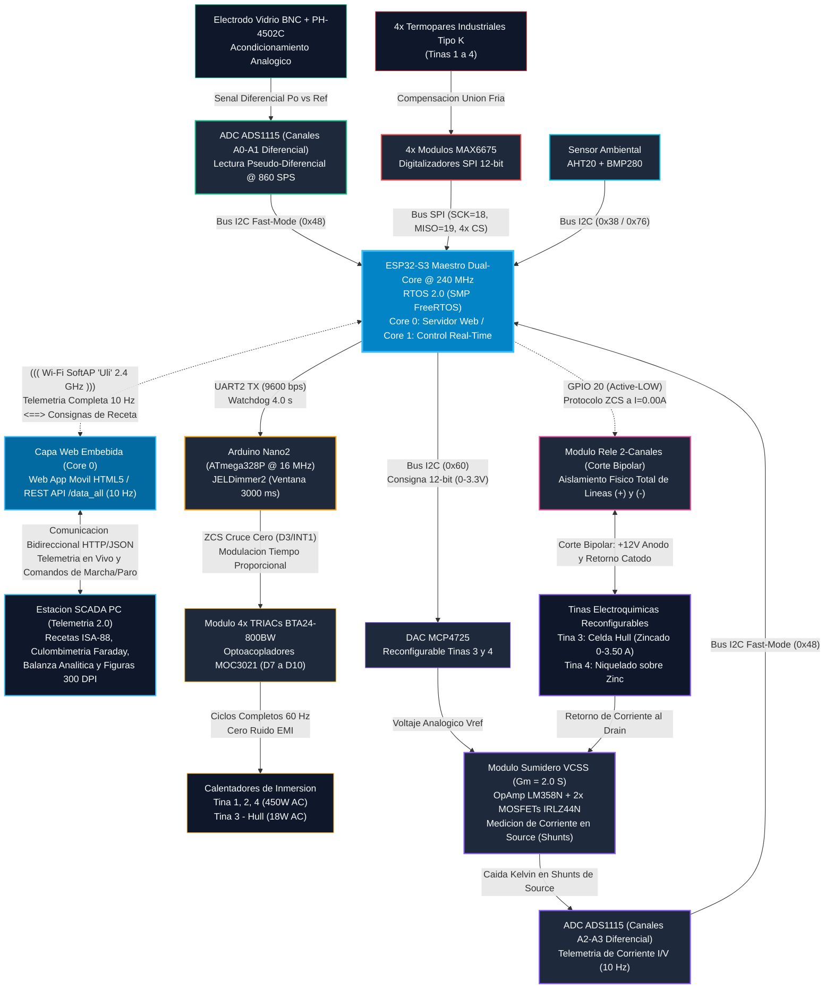
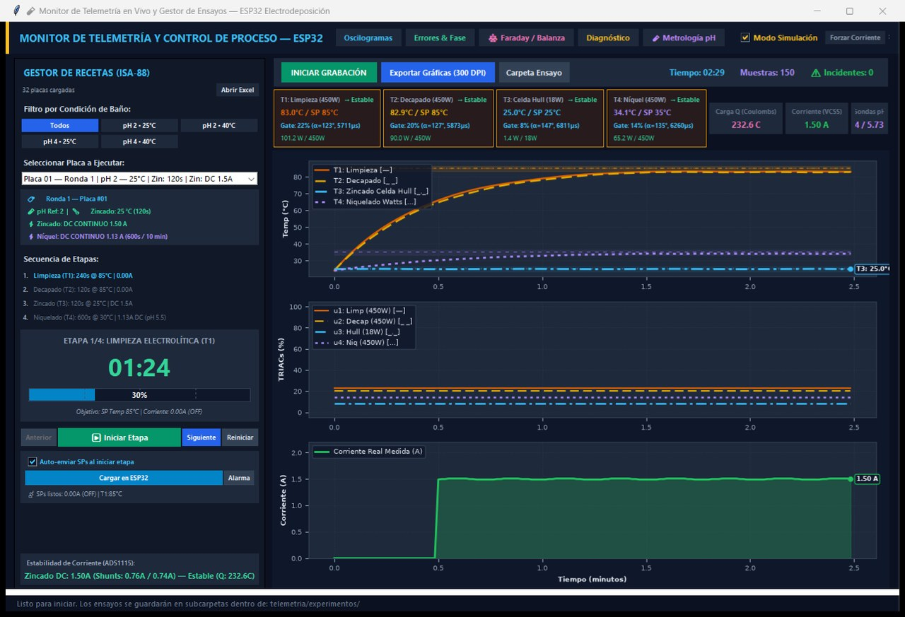
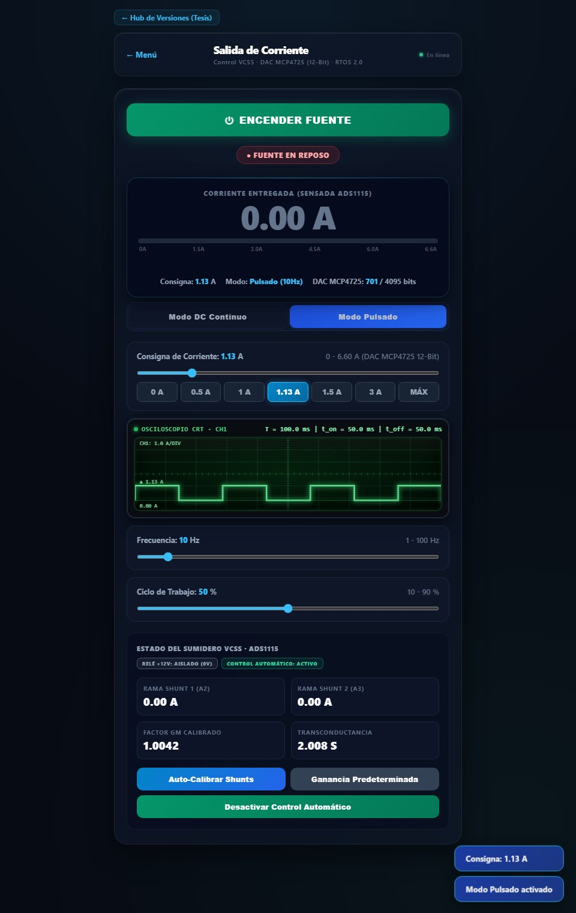

# Planta Piloto de Electrodeposición y Galvanoplastia
### Control Ciberfísico en Tiempo Real (ESP32-S3 RTOS 2.0 + ATmega328P + SCADA PC)

[-amber?style=for-the-badge&logo=git)](https://github.com/Chavacastro98/Proyecto)
[](https://chavacastro98.github.io/Proyecto/)
[](tests/)
[](firmware/)

> [!WARNING]
> ### 🚧 Repositorio en Desarrollo Activo / Work In Progress (WIP)
> **Este repositorio se encuentra actualmente en proceso de desarrollo, documentación y reestructuración activa.**  
> El equipo técnico se encuentra trabajando en:
> 1. **Elaboración y estandarización del Manual Técnico y Operativo de Laboratorio.**
> 2. **Consolidación y limpieza estructural de las páginas web públicas (GitHub Pages) y herramientas de despliegue.**
>
> 🌐 **Showcase Técnico Interactivo (GitHub Pages):** [https://chavacastro98.github.io/Proyecto/](https://chavacastro98.github.io/Proyecto/)  
> 📁 **Repositorio Oficial de Código (GitHub):** [https://github.com/Chavacastro98/Proyecto](https://github.com/Chavacastro98/Proyecto)  
> 📑 **Cartel Científico SMEQ 2026 — Folio CTS-C51:** *Optimización Electroquímica de Recubrimientos de Zinc sobre Aluminio 6061 T-6.*

---

## 1. De qué trata este sistema

La galvanoplastia sobre aluminio es un proceso notoriamente delicado: el aluminio forma espontáneamente una película pasivante de óxido que arruina la adherencia, mientras que los electrolitos ácidos y las altas corrientes de deposición generan ruido electromagnético y caídas de tensión parásitas que desestabilizan cualquier sensor estándar.

Este proyecto resuelve ese reto construyendo una **planta piloto automatizada de 3 tinas de tratamiento químico + Celda Hull (267 mL)**, gobernada por una arquitectura distribuida donde el hardware, el firmware en tiempo real y el software de supervisión en PC trabajan como una sola unidad:

1. **Etapa 1 — Desengrase Alcalino (85-90 °C, 240 s):** Limpieza termoquímica superficial con Na₃PO₄, Na₂SiO₃ y PEG-400.
2. **Etapa 2 — Decapado y Activación Alcalina (85-90 °C, 120 s):** Remoción selectiva de la película pasivante de alúmina sin atacar el metal base.
3. **Etapa 3 — Zincado en Celda Hull (25 °C o 40 °C, 120 o 300 s):** Electrodeposición en celda trapezoidal normalizada de 267 mL con corriente continua (1.50 A DC) o pulsada (10 Hz / 20% duty cycle) para evaluar el gradiente de densidad de corriente sobre toda la longitud de la probeta.
4. **Etapa 4 — Niquelado Electrolítico sobre Zinc (30-40 °C, 600 s):** Depósito protector final a 1.13 A DC con baño estabilizado para inhibir el desplazamiento galvánico espontáneo sobre el zinc subyacente.

---

## 2. Arquitectura Técnica (Versión RTOS 2.0)

El sistema opera con la versión de producción **RTOS 2.0**, diseñada para garantizar determinismo temporal, aislamiento total de ruido e instrumentación electroquímica de alta fidelidad:



---

### Galería de Interfaces de Usuario (SCADA PC y Web Móvil)

| Estación SCADA de Escritorio (Telemetría 2.0 en Python) | Interfaz Web Móvil Embebida (ESP32-S3 a Pie de Tina) |
| :---: | :---: |
|  |  |
| *Supervisión multivariable ISA-88, lazos térmicos de 4 tinas, culombimetría faradaica, osciloscopio virtual y balanza analítica.* | *Control táctil responsivo servido directamente por el Core 0 vía Wi-Fi SoftAP ('Uli') sin necesidad de conexión a Internet.* |

---

### Nodo Maestro ESP32-S3 (Dual-Core @ 240 MHz, 16 MB Flash, 8 MB PSRAM)
* **Concurrencia Simétrica FreeRTOS:**
  * **Core 1 (Tiempo Real Estricto):** Lazos de control térmico PI (1 Hz), modulación analógica de corriente VCSS, muestreo continuo a 860 SPS en ADC ADS1115 y máquina de seguridad Fail-Safe (50 Hz).
  * **Core 0 (Comunicaciones y Red):** Servidor HTTP embebido, endpoints REST JSON (`/data_all`, `/data_f`, `/data_t`, `/ph`), servidor de telemetría y actualización OTA (Over-The-Air) a través del punto de acceso Wi-Fi SoftAP ("Uli"). Esto permite operación totalmente autónoma e inalámbrica, eliminando cables USB hacia la computadora durante los ensayos electroquímicos.
* **Medición de pH en Modo Diferencial (Canales A0-A1, ADS1115):**  
  La señal potenciométrica del módulo PH-4502C se adquiere en modo diferencial (Canales A0 y A1) a través del convertidor ADS1115 a **860 SPS** para maximizar el rechazo de modo común y eliminar offset galvánico de masa. Aplica un filtro en cascada en Core 1: promedio por bloques, mediana móvil y filtro pasabajas IIR adaptativo (α = 0.30 en transitorios, α = 0.08 en reposo), con calibración multipunto independiente por modo persistida en Flash NVS.
* **Lazo de Corriente VCSS Reconfigurable (Sumidero Analógico Gm = 2.00 S):**  
  Fuente de corriente compartida y reconfigurable mediante DAC MCP4725 de 12 bits para **Tina 3 (Zincado en Celda Hull de 267 mL)** y **Tina 4 (Niquelado sobre Zinc)**. El lazo analógico (OpAmp LM358N + 2x MOSFETs IRLZ44N) mide la corriente en el **Source** mediante dos shunts cerámicos de 1.0 Ω / 10W en paralelo (resistencia equivalente de 0.50 Ω con 20W de disipación combinada), con retorno Kelvin hacia los canales **A2-A3 en modo diferencial** del ADS1115 y diagnóstico continuo de salud de celda (`SaludCelda_t`).

  | Control de Corriente Pulsada (Web Móvil) | Supervisión de Actuadores y Relés (SCADA) |
  | :---: | :---: |
  |  | 
  | *Modulación continua DC (1.50 A) o pulsada a 10 Hz con ciclo de trabajo programable.* | *Aislamiento bipolar físico en relé de 2 canales a corriente estrictamente nula (I=0.00A).* |

* **Secuencia ZCS con Relé de 2 Canales (Corte Bipolar Simultáneo $+$ y $-$):**  
  Al detener la fuente o finalizar el cronómetro de la etapa, el firmware anula la consigna del DAC a 0V, espera 30 ms para disipación de corriente remanente en la celda y abre el relé mecánico de 2 canales, **cortando simultáneamente tanto la línea positiva (+12V VDD) como la línea negativa de retorno catódico**, dejando la celda 100% aislada flotante y eliminando arcos eléctricos y desgaste de contactos.

### Coprocesador de Potencia AC (Arduino Nano2 ATmega328P @ 16 MHz)
* **Módulo de TRIACs de Fabricación Propia:** Etapa de potencia de 4 canales diseñada por el equipo con 4x TRIACs BTA24-800BW y optoacopladores MOC3021, gobernando 3 resistencias de inmersión de 450 W (Tinas 1, 2 y 4) y 1 calentador de cartucho de 18 W (Tina 3 - Celda Hull de 267 mL).
* **Firmware Nano2 (Tiempo Proporcional / Burst Firing ZCS):** Modula la potencia térmica a ciclos completos de 60 Hz en ventanas temporales fijas de 3000 ms mediante la librería `JELDimmer2`, conmutando exclusivamente en cruces por cero detectados por interrupción `INT1` en Pin D3. Esta estrategia erradica los transitorios $dv/dt$ y la interferencia electromagnética (EMI) sobre los sensores de pH y termopares.
* **Seguridad por Perro Guardián UART:** Si el enlace serie con el ESP32 se interrumpe por más de 4000 ms, el Nano apaga inmediatamente todas las compuertas de los TRIACs (D7 a D10).

### SCADA Telemetría 2.0 (Python / Windows)
* **Gestión de Recetas ISA-88 desde Excel:** Carga dinámica de la matriz experimental (`matriz_experimentos.xlsx`) para 32 probetas, con selección automática de tiempos, consignas de temperatura y modos de corriente (DC continuo o Pulsado a 10 Hz / 20% duty cycle, con soporte para columnas personalizadas de frecuencia y ciclo de trabajo).
* **Culombimetría Faradaica en Lazo Cerrado:** Integración activa únicamente durante la cuenta del cronómetro de etapas galvánicas (`etapa_corriendo == True` y `act == 1`), ponderando por ciclo de trabajo en corriente pulsada (`I_efectiva = I_pico × Duty/100`) y congelando la acumulación al llegar a 00:00 o en pausas.
* **Modelo Aditivo Bicapa Zn + Ni:** Cálculo de masa teórica total `m_teo = Q_Zn × 0.33880 mg/C + Q_Ni × 0.30414 mg/C` acoplado con pesaje en balanza analítica para determinar la eficiencia catódica global (η%) y los espesores individuales y totales de película (μm).
* **Motor de Exportación Científica:** Generación de figuras publication-ready a 300 DPI y registro en CSV estructurado con marcas ISA-88 y tiempos muertos de transferencia.
* **Datos Demostrativos y Validación Funcional:** Las curvas y registros CSV incluidos actualmente en el repositorio corresponden a corridas de validación funcional en banco para estandarización del manual operativo y del showcase científico (SMEQ 2026). La campaña experimental formal de 32 probetas completas se encuentra bajo custodia del equipo de investigación de tesis.

---

## 3. Estructura del Repositorio

El árbol de archivos está organizado de manera modular, separando firmware, software de escritorio, ingeniería de hardware, pruebas y despliegue web:

```text
Proyecto/
├── Iniciar_Sistema.bat        <- Lanzador interactivo principal (doble clic)
├── Iniciar_Telemetria_2.0.bat <- Acceso directo a la estacion SCADA en vivo
├── launcher.py                <- Panel maestro de inicio en Python (GUI y consola)
├── README.md                  <- Documentacion tecnica y de arquitectura (WIP)
├── AGENTS.md                  <- Estandares de codificacion, estilo y formato
├── requirements.txt           <- Dependencias oficiales de Python
├── pytest.ini                 <- Configuracion de la suite de pruebas unitarias
├── conftest.py                <- Resolucion limpia de rutas para tests
├── .gitignore                 <- Reglas de exclusion y proteccion de datos sensibles
│
├── docs/                      <- Publicacion web oficial GitHub Pages (Arquitectura modular)
│   ├── index.html             <- Punto de entrada del Showcase Tecnico e Interactivo
│   ├── css/                   <- Estilos CSS modulares (tokens, layout, components, responsive)
│   ├── js/                    <- Modulos de logica JS (app, simuladores, galeria, telemetria)
│   └── assets/                <- Evidencia fotografica, diagramas e instrumentacion
│
├── firmware/                  <- Codigo fuente de microcontroladores
│   ├── esp32/
│   │   ├── RTOS2.0/           <- Firmware de produccion activo (FreeRTOS Dual-Core SMP)
│   │   └── historico/         <- Registro historico de versiones (RTOS 1.0-1.4 y Superloop)
│   └── arduino_nano/
│       ├── nano2/             <- Firmware de calentamiento activo: Tiempo proporcional (Burst Firing 3s)
│       ├── nano/              <- Variante alternativa con control por recorte de fase (LUT 60Hz)
│       └── historico/         <- Prototipos previos (Nano Beta)
│
├── software/                  <- Software SCADA y procesamiento en PC
│   ├── telemetria2.0/         <- SCADA activo (Matriz ISA-88, Faraday, Balanza analitica)
│   ├── telemetria/            <- SCADA base v1.0 (referencia)
│   └── exportar_graficas_offline.py <- Generador de figuras cientificas a 300 DPI
│
├── tests/                     <- Suite de pruebas automatizadas (Pytest)
│   ├── test_calculos.py       <- Culombimetria de Faraday, duty cycle y linealizacion del TRIAC
│   ├── test_interlocks.py     <- Validacion de interlocks ISA-88 y secuencia ZCS
│   └── test_telemetria_json.py <- Esquemas y contratos JSON entre ESP32 y SCADA
│
├── hardware/                  <- Documentacion fisica y electronica
│   ├── esquemas_y_bom/        <- Lista de materiales (BOM.md) y diagramas de conexion
│   └── control_matlab/        <- Modelado termico y cinetico en MATLAB
│
├── herramientas/              <- Utilidades de automatizacion y soporte CI/CD
│   └── sincronizar_pages.py   <- Pipeline automatico de empaquetado y despliegue a docs/
│
├── documentos/                <- Documentacion tecnica y manuales de operacion
│   ├── manuales/              <- Manual interactivo de operacion quimica (HTML y Markdown)
│   ├── guias/                 <- Guia de configuracion y compilacion de herramientas
│   ├── datasheets/            <- Hojas de datos de componentes electronicos y sensores
│   ├── imagenes/              <- Capturas de interfaz y diagramas
│   └── instaladores/          <- Scripts de configuracion de dependencias
│
└── visualizacion/             <- Diagramas y simuladores
    ├── diagramas/             <- Visor interactivo y modelos Mermaid de arquitectura
    └── preview/               <- Simuladores web offline de las interfaces del ESP32
```

---

## 4. Aseguramiento de Calidad y Pruebas Automatizadas

El proyecto cuenta con una suite de **25 pruebas unitarias automatizadas** que se ejecutan en menos de 0.05 segundos con `pytest`:

```bash
python -m pytest -v
```

* **Física y Metrología ([tests/test_calculos.py](tests/test_calculos.py)):** Verificación matemática de la masa teórica faradaica en DC y pulsado ponderado por ciclo de trabajo, inmunidad de integración en reposo, modelo bicapa aditivo Zn+Ni, espesores micrométricos y linealización de retardo TRIAC de 60 Hz (0 a 8333 μs).
* **Interlocks de Seguridad ([tests/test_interlocks.py](tests/test_interlocks.py)):** Verificación del aislamiento entre electrodo de pH y lazo de corriente, enclavamiento por Fail-Safe, restricciones de calibración y conmutación ZCS.
* **Contratos de Telemetría ([tests/test_telemetria_json.py](tests/test_telemetria_json.py)):** Validación de rangos del DAC (0 a 4095), transconductancia Gm, resolución de sensores y manejo defensivo ante pérdidas parciales de paquetes.
* **Pre-Commit Hook (.git/hooks/pre-commit):** Cada commit en Git corre automáticamente la suite completa; si se introduce una regresión matemática o lógica, el commit se detiene.

---

## 5. Puesta en Marcha

### Requisitos:
* Sistema operativo Windows 10 u 11.
* Python 3.9 o superior.

### Instalación en 2 pasos:
1. Clonar el repositorio e instalar las dependencias:
   ```bash
   git clone https://github.com/Chavacastro98/Proyecto.git
   cd Proyecto
   pip install -r requirements.txt
   ```
2. Ejecutar el panel de control:
   * Hacer doble clic en [`Iniciar_Sistema.bat`](Iniciar_Sistema.bat), o
   * Ejecutar en terminal:
     ```bash
     python launcher.py
     ```

Para iniciar directamente la estación de monitoreo SCADA en vivo, haz doble clic en [`Iniciar_Telemetria_2.0.bat`](Iniciar_Telemetria_2.0.bat).

---

## 6. Generación de Figuras Científicas (300 DPI)

Para generar el paquete de figuras científicas de alta resolución para la memoria de resultados:

```bash
python software/exportar_graficas_offline.py
```

Genera automáticamente las 8 figuras normalizadas:
1. **01:** Perfil electroquímico y térmico simultáneo de las 4 tinas.
2. **02:** Error de seguimiento térmico instantáneo `e(t) = SP - PV` con bandas de tolerancia de ±0.5 °C e índice IAE.
3. **03:** Ángulos de disparo del TRIAC α (°), retardos de compuerta (μs) y potencia RMS calculada.
4. **04:** Culombimetría faradaica integrada `Q(t) = ∫ I dt`, comparación gravimétrica y plano de fase.
5. **05:** Diagnóstico integral de proceso (consumo energético acumulado en Wh, gravimetría y condiciones meteorológicas).
6. **06:** Diagrama de Gantt de fases operativas ISA-88 y tiempos muertos de transferencia.
7. **07:** Reconstrucción ETS (Equivalent Time Sampling) de la forma de onda de corriente a 100 Hz.
8. **08:** Distribución longitudinal de densidad de corriente J(x) en Celda Hull y perfil de espesor de zinc.

---

## 7. Equipo de Investigación y Desarrollo

### 🧪 Investigación Electroquímica & Tesis de Grado
* **Víctor Ulises Gutiérrez Ramírez**  
  * Correo Institucional: [victor.gutierrez7221@alumnos.udg.mx](mailto:victor.gutierrez7221@alumnos.udg.mx)  
  * **Áreas:** Investigación electroquímica, formulación de baños químicos y aditivos, diseño de experimentos (DoE 2⁵·4 / Taguchi), análisis gravimétrico, metalografía y conclusiones de grado.

### ⚙️ Plataforma de Ensayos & Automatización (Salvador² C Dev Team)
* **Salvador Castro Pérez**  
  * Correo Institucional: [salvador.castro7435@alumnos.udg.mx](mailto:salvador.castro7435@alumnos.udg.mx)  
* **Fernando Salvador Samayoa Martínez**  
  * Correo Institucional: [fernando.samayoa0621@alumnos.udg.mx](mailto:fernando.samayoa0621@alumnos.udg.mx) | [fsamayoamarinez@gmail.com](mailto:fsamayoamarinez@gmail.com)  

**Desarrollos de la Plataforma:**
* **Instrumentación y Sensores:** Acondicionamiento de pH pseudo-diferencial con aislamiento galvánico, termometría multizona y monitoreo ambiental.
* **Firmware Embebido:** ESP32-S3 (RTOS 2.0 bajo FreeRTOS SMP) y Arduino Nano2 (conmutación ZCS por tiempo proporcional a ciclos completos).
* **Electrónica de Potencia:** Sumidero reconfigurable VCSS (DAC + OpAmps + MOSFETs) y relé bipolar ZCS.
* **Modelado y Control:** Modelo térmico de tinas y sintonización analítica de lazos PI.
* **Software y UI/UX:** SCADA Telemetría 2.0 (PyQt6) y servidor Web embebido.
* **Aseguramiento de Calidad:** Matriz de interlocks de seguridad y pruebas de integración.

### 🎓 Directores de Tesis
* **Dr. Omar Alejandro González Meza** — Profesor Investigador, CUCEI, Universidad de Guadalajara.
* **Dr. Norberto Casillas Santana** — Profesor Investigador, Departamento de Química, CUCEI, Universidad de Guadalajara.

---

**Salvador² C Dev Team**  
*Ingeniería de Automatización, Sistemas Embebidos, Electrónica de Potencia e Instrumentación Científica.*  
*Centro Universitario de Ciencias Exactas e Ingenierías (CUCEI) — Universidad de Guadalajara.*
