# 🧪 Manual de Operación Química y Protocolo de Laboratorio
## Planta Piloto de Electrodeposición y Galvanoplastia (Protocolo VUGR / SMEQ26)

| Campo | Detalle |
|:---|:---|
| **Versión del Documento** | 2.0 |
| **Fecha de Emisión** | Septiembre 2026 |
| **Firmware Asociado** | RTOS 2.0.0 (ESP32-S3) + nano.ino (ATmega328P) |
| **Estado** | 🟡 En desarrollo — Pendiente: fotografías de planta física y sistema de instrumentación |

**Sustrato Base:** Probetas de Aleación de Aluminio 6061-T6 (100 mm · 65 mm · 0.8 mm, Área útil sumergida: 1.0 dm²)  
**Línea de Proceso:** Tren automatizado de 4 tinas de proceso (Desengrase Alcalino → Decapado Alcalino → Celda Hull Zincado Ácido → Niquelado sobre Zinc)  
**Control y Supervisión:** Sistema Maestro ESP32-S3 (RTOS 2.0) + Módulo Dimmer Arduino Nano + SCADA PC Telemetría 2.0 con Balanza Analítica Asistida (Ley de Faraday)

---

## 📑 Índice de Contenidos
1. [Fundamentos Electroquímicos del Sustrato de Aluminio](#1-fundamentos-electroquímicos-del-sustrato-de-aluminio)
2. [Formulación y Preparación de Soluciones Químicas por Tina](#2-formulación-y-preparación-de-soluciones-químicas-por-tina)
   - [Tina 1: Desengrase Alcalino](#tina-1-desengrase-alcalino-limpieza-superficial)
   - [Tina 2: Decapado Alcalino](#tina-2-decapado-alcalino-activación-superficial)
   - [Tina 3: Celda Hull — Zincado Ácido](#tina-3-celda-hull-de-267-ml--zincado-en-medio-ácido)
   - [Tina 4: Niquelado sobre Zinc](#tina-4-niquelado-sobre-zinc-recubrimiento-final)
3. [Protocolo Operativo Estándar (Paso a Paso en Laboratorio)](#3-protocolo-operativo-estándar-paso-a-paso-en-laboratorio)
4. [Guía del Operador: Supervisión SCADA en Tiempo Real y Suite Científica Post-Proceso](#4-guía-del-operador-supervisión-scada-en-tiempo-real-y-suite-científica-post-proceso)
   - [4.1 Entorno SCADA en Tiempo Real](#41-entorno-scada-de-escritorio-en-tiempo-real-supervisión-viva-con-buffer-fifo-limitado)
   - [4.2 Suite de Graficación Científica Post-Ensayo](#42-suite-de-graficación-científica-post-ensayo-a-300-dpi-softwareexportar_graficas_offlinepy)
5. [Modelado y Cálculos de Eficiencia de Corriente y Espesor](#5-modelado-y-cálculos-de-eficiencia-de-corriente-y-espesor)
6. [Calibración de Instrumentación (pH, Temperatura y Corriente VCSS)](#6-calibración-de-instrumentación-ph-temperatura-y-corriente-vcss)
   - [6.1 Calibración de Electrodos de pH](#calibración-de-electrodos-de-ph-soluciones-buffer-401-700-y-1001)
   - [6.2 Verificación de Termopares Tipo K](#62-verificación-de-termopares-tipo-k-max6675)
   - [6.3 Verificación de Corriente VCSS (Multímetro)](#63-verificación-del-sumidero-de-corriente-vcss-prueba-práctica-con-multímetro)
7. [Guía de Diagnóstico y Solución de Problemas (Química, Hardware y Firmware)](#7-guía-de-diagnóstico-y-solución-de-problemas-química-hardware-y-firmware)
   - [7.1 Sintonía de Lazos PI Térmicos](#71-tabla-de-sintonía-de-lazos-pi-térmicos)
   - [7.2 Resolución de Anomalías de Hardware, Señal y Firmware](#72-resolución-de-anomalías-de-hardware-señal-y-firmware)
8. [Seguridad Química y Gestión de Residuos](#8-seguridad-química-y-gestión-de-residuos)
9. [Arquitectura del Software, Librerías y Entornos de Desarrollo](#9-arquitectura-del-software-librerías-y-entornos-de-desarrollo)
   - [9.6 Ingeniería Electrónica y Esquemáticos](#96-ingeniería-electrónica-circuitos-y-lista-de-materiales-carpeta-hardware)
   - [9.11 Mapa de Pines (Pinout) del ESP32-S3 y Arduino Nano](#911-mapa-de-pines-pinout-del-hardware)
10. [Planta Física, Ficha Técnica y Modularidad de Hardware](#10-planta-física-ficha-técnica-y-modularidad-de-hardware)
    - [10.1 Ficha Técnica Consolidada de la Plataforma](#101-ficha-técnica-consolidada-de-la-plataforma)
    - [10.2 Distribución de Pines y Conexión en Zócalos Hembra](#102-distribución-de-pines-y-conexión-en-zócalos-hembra)
    - [10.3 Guía de Remplazabilidad y Mantenimiento en Campo](#103-guía-de-remplazabilidad-y-mantenimiento-en-campo)
    - [10.4 Galería Fotográfica de la Planta en Operación](#104-galería-fotográfica-de-la-planta-en-operación)
11. [Preguntas Frecuentes (FAQ)](#11-preguntas-frecuentes-faq)
12. [Glosario de Términos Técnicos](#12-glosario-de-términos-técnicos)
13. [Reconocimientos a Proyectos Open Source & Términos de Uso Libre](#13-reconocimientos-a-proyectos-open-source--términos-de-uso-libre)

---

## 1. Fundamentos Electroquímicos del Sustrato de Aluminio

El **Aluminio 6061-T6** es una aleación ligera de alta resistencia mecánica (Al-Mg-Si), pero presenta dos desafíos fundamentales para la galvanoplastia:
1. **Película Pasiva de Alúmina (Al₂O₃):** Al contacto con el aire, el aluminio forma espontáneamente una capa de óxido anfótero, dieléctrico y químicamente inerte que inhibe la adhesión de cualquier depósito metálico.
2. **Potencial Estándar Altamente Negativo (E°_{Al³⁺/Al} = -1.66 V):** En medios acuosos ácidos convencionales, el aluminio reacciona violentamente disolviéndose por desplazamiento galvánico espontáneo frente a metales más nobles como el níquel (E°_{Ni²⁺/Ni} = -0.25 V), generando depósitos pulverulentos, negros y sin adherencia.

> [!IMPORTANT]
> **Por qué Decapado Alcalino y NO Ácido:**
> Un decapado ácido agresivo genera ataque localizado por picaduras (*pitting*) en los micro-constituyentes intermetálicos (Mg₂Si, FeAl₃). El **decapado alcalino suave** con fosfato trisódico disuelve uniformemente la alúmina sin agredir la matriz metálica, preparando el sustrato para recibir una capa intermedia densa de **zinc** que sella el aluminio antes del baño de níquel.

---

## 2. Formulación y Preparación de Soluciones Químicas por Tina

### Tina 1: Desengrase Alcalino (Limpieza Superficial)
* **Objetivo:** Remoción de aceites lubricantes de maquinado, grasa orgánica y contaminantes particulados.
* **Capacidad de Tina:** 2.0 a 3.0 L.
* **Formulación por Litro (1.0 L):**
  * Fosfato trisódico dodecahidratado (Na₃PO₄ · 12H₂O): **25.0 g/L**
  * Metasilicato de sodio (Na₂SiO₃): **25.0 g/L** *(limpiador y emulsificante)*
  * Polietilenglicol (PEG-400): **5.0 mL/L** *(surfactante no iónico para abatir tensión superficial)*
* **Parámetros de Control:**
  * Temperatura: **80 a 95°C** (Consigna recomendada: **85°C**).
  * Potencia del calentador: 450 W AC con modulación PI por cruce por cero.
  * Tiempo de inmersión: **240 s** (4 minutos).
  * Corriente: **0.00 A** (Ataque puramente termoquímico).

---

### Tina 2: Decapado Alcalino (Activación Superficial)
* **Objetivo:** Disolución controlada de la película de óxido nativo (Al₂O₃), exponiendo el aluminio puro activo sin picadura ácida.
* **Capacidad de Tina:** 2.0 a 3.0 L.
* **Formulación por Litro (1.0 L):**
  * Fosfato trisódico dodecahidratado (Na₃PO₄ · 12H₂O): **37.5 g/L**
  * Agua desionizada o destilada: c.b.p. 1.0 L.
* **Reacción Química:**
  ```text
Al₂O₃ + 2 PO₄³⁻ + 3 H₂O → 2 AlPO₄(ac) + 6 OH⁻
```
* **Parámetros de Control:**
  * Temperatura: **80 a 95°C** (Consigna recomendada: **85°C**).
  * Potencia del calentador: 450 W AC.
  * Tiempo de inmersión: **120 s** (2 minutos).
  * Corriente: **0.00 A**.

---

### Tina 3: Celda Hull de 267 mL — Zincado en Medio Ácido
* **Objetivo:** Electrodeposición de una capa protectora y adherente de Zinc (Zn). La geometría trapezoidal de la Celda Hull de 267 mL crea un gradiente continuo de densidades de corriente (0.5 a 5.0 A/dm²), permitiendo correlacionar el rango óptimo de brillo, adherencia y ausencia de quemado.
* **Capacidad de Celda:** **267 mL** normalizada.
* **Formulación por Litro (1.0 L):**
  * Sulfato de zinc heptahidratado (ZnSO₄ · 7H₂O): **300.0 g/L** *(fuente primaria de iones Zn²⁺)*
  * Cloruro de sodio (NaCl): **15.0 g/L** *(incrementa conductividad y solubilidad anódica)*
  * Ácido bórico (H₃BO₃): **20.0 g/L** *(amortiguador de pH en la película catódica)*
  * Sulfato de aluminio (Al₂(SO₄)₃ · 18H₂O): **30.0 g/L** *(refinador de tamaño de grano cristalino)*
  * Almidón soluble: **3.0 g/L** *(abrillantador orgánico y supresor de crecimiento dendrítico)*
* **Parámetros de Control:**
  * **pH:** **2.0 a 4.0** (monitoreado en tiempo real con electrodo analógico).
  * **Temperatura:** **25°C** (ambiente) o **40°C** (calentador de celda Hull de 18 W).
  * **Consigna de Corriente (VCSS):** **1.50 A** (Corriente Continua DC o Pulsada a 10 Hz con 20% de ciclo de trabajo).
  * **Tiempo de Inmersión:** **120 s** (2 min) o **300 s** (5 min) según matriz Taguchi.
  * **Ánodo:** Placa de Zinc de alta pureza (99.9%).
  * **Cátodo:** Probeta preparada de Al 6061-T6.

---

### Tina 4: Niquelado sobre Zinc (Recubrimiento Final)
* **Objetivo:** Depósito electroquímico final de Níquel metálico (Ni) de alto brillo, dureza y resistencia a la corrosión sobre la capa previa de zinc.
* **Capacidad de Tina:** 2.0 a 3.0 L.
* **Formulación Especializada por Litro (1.0 L):**
  * Sulfato de níquel hexahidratado (NiSO₄ · 6H₂O): **140.0 g/L** *(fuente de iones Ni²⁺)*
  * Sulfato de sodio anhidro (Na₂SO₄): **66.14 g/L**  
    > [!TIP]
    > **Rol del Sulfato de Sodio (Na₂SO₄):**  
    > En baños estándar tipo Watts, la alta actividad de níquel disuelve el zinc de la probeta por reemplazo galvánico. El Na₂SO₄ incrementa la fuerza iónica y reduce la disociación libre del Ni²⁺, inhibiendo el ataque galvánico al zinc subyacente.
  * Cloruro de amonio (NH₄Cl): **16.5 g/L** *(mejora disolución anódica y conductividad)*
  * Ácido bórico (H₃BO₃): **15.5 g/L** *(estabilizador de pH en interfase catódica)*
* **Parámetros de Control:**
  * **pH:** **5.6 a 5.9** (ajustar con NH₄OH diluido si es bajo, o H₂SO₄ al 10% si es alto).
  * **Temperatura:** **20 a 40°C** (Consigna recomendada: **30 a 35°C**).
  * **Corriente:** **1.13 A DC** constante (J ≈ 1.13 A/dm²).
  * **Tiempo de Inmersión:** **600 s** (10 minutos).
  * **Ánodo:** Cesta o placa de Níquel electrolítico (99.9%).

---

## 3. Protocolo Operativo Estándar (Paso a Paso en Laboratorio)

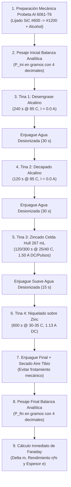
```mermaid
flowchart TD
    A["1. Preparación Mecánica Probeta Al 6061-T6<br>(Lijado SiC #600 -> #1200 + Alcohol)"] --> B["2. Pesaje Inicial Balanza Analítica<br>(P_ini en gramos con 4 decimales)"]
    B --> C["3. Tina 1: Desengrase Alcalino<br>(240 s @ 85 C, I = 0.0 A)"]
    C --> D["Enjuague Agua Desionizada (30 s)"]
    D --> E["4. Tina 2: Decapado Alcalino<br>(120 s @ 85 C, I = 0.0 A)"]
    E --> F["Enjuague Agua Desionizada (30 s)"]
    F --> G["5. Tina 3: Zincado Celda Hull 267 mL<br>(120/300 s @ 25/40 C, 1.50 A DC/Pulsos)"]
    G --> H["Enjuague Suave Agua Desionizada (15 s)"]
    H --> I["6. Tina 4: Niquelado sobre Zinc<br>(600 s @ 30-35 C, 1.13 A DC)"]
    I --> J["7. Enjuague Final + Secado Aire Tibio<br>(Evitar frotamiento mecánico)"]
    J --> K["8. Pesaje Final Balanza Analítica<br>(P_fin en gramos con 4 decimales)"]
    K --> L["9. Cálculo Inmediato de Faraday<br>(Delta m, Rendimiento η% y Espesor e)"]
```

### Detalle de las Operaciones Físicas:
1. **Preparación Previa:** Desbaste de probetas de aluminio con papel abrasivo de carburo de silicio (grano 600 y 1200), lavado con alcohol isopropílico para retirar polvo metálico y secado.
2. **Transferencia entre Tinas:** El tiempo de transferencia entre el enjuague de la Tina 2 y la inmersión en la Tina 3 (Zincado) no debe superar **15 segundos** para evitar la re-oxidación pasiva del aluminio expuesto con el aire.
3. **Manejo de Probetas:** Manipular en todo momento con pinzas de acero inoxidable o guantes limpios de nitrilo por los bordes superiores que no quedan sumergidos en la solución.

---

## 4. Guía del Operador: Supervisión SCADA en Tiempo Real y Suite Científica Post-Proceso

La estación instrumental cuenta con dos entornos de software complementarios diseñados con propósitos analíticos distintos:
1. **Entorno SCADA de Escritorio en Tiempo Real (`software/telemetria2.0/`):** Supervisión viva a 10 Hz, pilotaje del banco de trabajo, soporte para sensor de pH dedicado en Canal A1 y control de fases ISA-88.
2. **Suite de Graficación Científica Post-Proceso (`software/exportar_graficas_offline.py` a 300 DPI):** Análisis exhaustivo fuera de línea de la totalidad del experimento (1200+ s) sin límites de buffer, generando hasta 8 figuras de calidad editorial.

---

### 4.1 Entorno SCADA de Escritorio en Tiempo Real (Supervisión Viva con Buffer FIFO Limitado)

#### Pasos para Ejecutar un Ensayo en Laboratorio:
1. **Encendido General (Alimentación Directa en 1 Paso):**
   * Enchufar el cable de poder principal a la red AC (120V / 60 Hz). La fuente industrial conmutada de 12V / 10A cuenta con su propio fusible interno de protección y no requiere fusibles externos ni secuencias manuales complejas de encendido.
   * Verificar en el display LED del módulo LM2596 la indicación de **6.80 V**.
   * Verificar que la baliza LED Neopixel en el ESP32 indique color **Verde (Destello)** si está en espera de conexión Wi-Fi SoftAP "Uli", o **Verde (Fijo)** una vez conectado el operador por Wi-Fi (Sistema en Reposo / Standby listo sin comandos activos).
2. **Iniciar la Aplicación SCADA:**
   * En la computadora de laboratorio, hacer doble clic en el acceso directo **[`Iniciar_Telemetria_2.0.bat`](../../Iniciar_Telemetria_2.0.bat)** o en el panel interactivo **[`Iniciar_Sistema.bat`](../../Iniciar_Sistema.bat)**.
   * La interfaz gráfica Tkinter de Telemetría 2.0 se abrirá a pantalla completa.
3. **Selección de Receta Experimental (Matriz Taguchi):**
   * En el panel superior, seleccionar el número de placa (1 a 32) de acuerdo con las condiciones planificadas:
     * *Temperatura Celda Hull:* 25°C (Ambiente) o 40°C.
     * *Modo de Corriente:* DC (Corriente Continua) o Pulsado (10 Hz, ciclo útil 20%).
     * *pH del Baño:* 2.0 o 4.0.
4. **Registro de Peso Inicial (P(ini)):**
   * Pesar la probeta virgen seca en la balanza analítica del laboratorio (apreciación de 0.1 mg / 0.0001 g).
   * Presionar el botón **"Iniciar Grabación"** en el software.
   * En la ventana modal de pesaje: escribir el peso inicial (ej. `42.1524`) y presionar *Aceptar*.
5. **Supervisión Automática durante el Ensayo:**
   * El sistema encenderá los calentadores mediante control PI suave, evitando fluctuaciones térmicas.
   * En la Tina 3 (Zincado) y Tina 4 (Niquelado), el sumidero de corriente VCSS activará la rampa suave de corriente (*Soft-Start* de 500 ms) y conmutación a corriente cero (*ZCS*) para proteger la celda.
   * En la pantalla se observará el indicador de **Salud de Celda** (`CELDA_OK` en verde).
6. **Alarma y Pesaje Final (P(fin)):**
   * Al concluir la etapa de electrodeposición, sonará una alarma sonora industrial continua.
   * Retirar la placa, enjuagarla con agua desionizada, secarla con flujo suave de aire tibio.
   * Pesar nuevamente en la balanza analítica.
   * Ingresar el peso final en la ventana modal de Faraday (ej. `42.1702`).
7. **Generación de Gráficas y Reporte Científico:**
   * Al presionar **"Exportar Gráficas (300 DPI)"**, el software ejecutará el compilador científico de Telemetría 2.0 (o `exportar_graficas_offline.py`), generando la suite completa de figuras de alta definición en la carpeta del ensayo.

> [!NOTE]
> **Dinámica de Visualización en Tiempo Real (Buffer FIFO Circular):**  
> Los osciloscopios virtuales de la aplicación SCADA en vivo operan mediante una **memoria intermedia circular FIFO (ventana temporal deslizante con buffer de salida acotado)**. Esta arquitectura fue diseñada deliberadamente para mantener una respuesta interactiva fluida a 10 Hz con latencia cero, impidiendo el desbordamiento de memoria RAM o la degradación de la CPU durante jornadas prolongadas de operación. Por tanto, en pantalla viva sólo se visualiza el tramo reciente del ensayo. Para la auditoría, integración analítica y reporte del experimento completo (de 0 a 1200+ segundos), consúltese la **Sección 4.2**.

> [!TIP]
> **Autonomía Operativa ante Desconexión o Fallo del SCADA:**  
> La ejecución de los lazos de control deterministas reside al 100% en el firmware FreeRTOS de los microcontroladores (lazo VCSS en Core 1 del ESP32-S3 y lazo de corte de fase AC en el Arduino Nano). Si la computadora de escritorio se desconecta, el cable se interrumpe, el SCADA se cierra o el sistema operativo Windows se congela a mitad de un ensayo, **la planta continuará regulando la corriente y las temperaturas de forma autónoma sin arruinar el lote químico**. El operador puede supervisar el estado o abortar el ensayo de emergencia en cualquier momento conectándose desde un smartphone o tablet a la red Wi-Fi `Uli` y abriendo `http://192.168.4.1`.

#### Galería de Pantallas del SCADA en Funcionamiento:

##### 1. Pantalla Principal del SCADA ([`scada_01_principal.png`](imagenes/scada_01_principal.png))
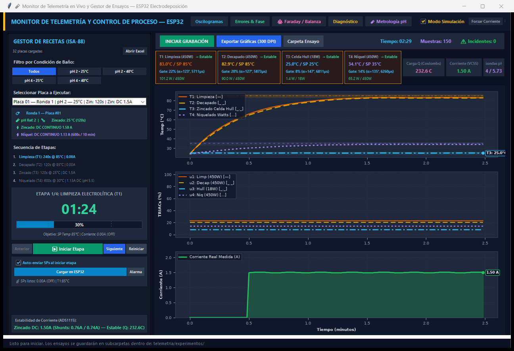
* **Descripción de la Interfaz:** Centro de comando unificado donde el operador supervisa la telemetría global a 10 Hz.
* **Componentes Principales:**
  * **Columna Izquierda (Gestor de Recetas ISA-88):** Mapeo de la matriz de probetas, selección de ensayo activo (Placa 01 a 1.50 A) y temporizador regresivo de etapa en color cian (`01:24` restantes, 30% completado).
  * **Encabezado Superior:** Tarjetas de proceso de las 4 tinas con ángulo de disparo (&alpha;) y potencia disipada (T1 83.0°C / SP 85°C, 101.2W; T2 82.9°C / SP 85°C, 90.0W; T3 25.0°C / SP 25°C, 1.4W; T4 34.1°C / SP 35°C, 65.2W), carga acumulada (Q = 232.6 C), corriente (1.50 A), pH de sondas (4.00 / 5.73) y botones de acceso rápido a ventanas modulares.
  * **Panel Central (Osciloscopios en Streaming):** 3 gráficos en tiempo real: (1) Temperatura multizona en °C, (2) Porcentaje de modulación de compuerta TRIAC (%) y (3) Corriente inyectada por el sumidero VCSS (1.50 A).

---

##### 2. Ventana Modular: Osciloscopio Digital de Actuadores y Conmutación AC ([`scada_02_actuadores.png`](imagenes/scada_02_actuadores.png))
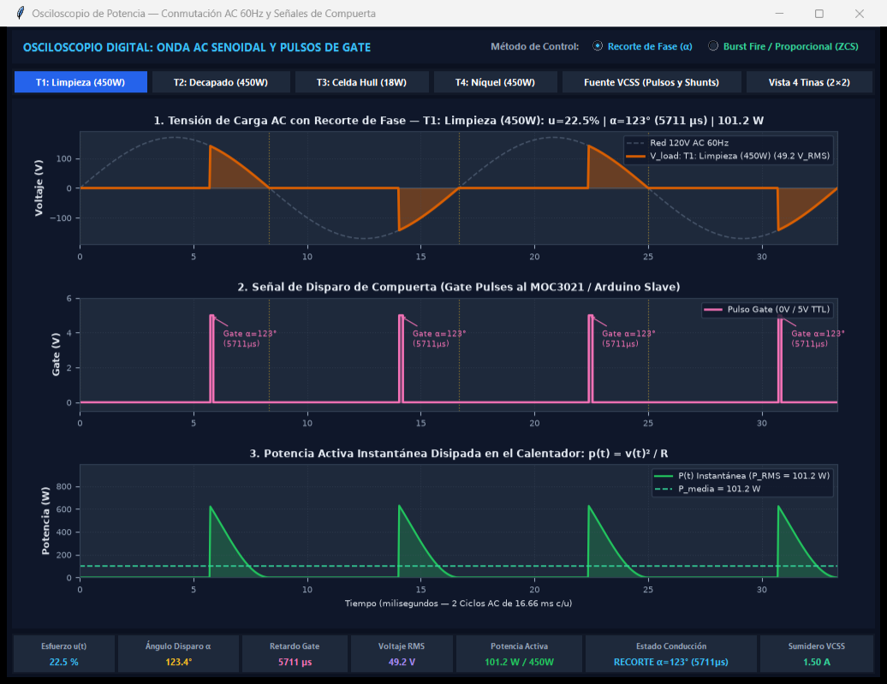
* **Descripción de la Interfaz:** Módulo de inspección eléctrica profunda para auditar la física de conmutación de los optoacopladores MOC3021 y los TRIACs BTA24-600B.
* **Componentes Principales:**
  * **Selectores Superiores:** Alternancia entre *Recorte de Fase (&alpha;)* y *Burst Fire / Proporcional (ZCS)*, con pestañas independientes para las 4 tinas (T1 a T4), el sumidero VCSS y la vista consolidada 2×2.
  * **Panel de 3 Canales Sincronizados:**
    1. *Tensión de Carga AC:* Forma de onda recortada de 60 Hz comparada contra la red de 120 VAC.
    2. *Pulsos de Disparo de Compuerta (Gate):* Tren de pulsos TTL de 5V inyectados al pin de disparo del MOC3021 con el retardo exacto de fase (5711 μs).
    3. *Potencia Activa Instantánea:* Curva disipada p(t) = v(t)² / R y potencia media cuadrática (101.2 W).
  * **Barra Inferior de KPIs Eléctricos:** Esfuerzo u(t) = 22.5%, ángulo α = 123.4°, retardo de compuerta 5711 μs, tensión cuadrática media V(RMS) = 49.2 V, potencia activa disipada 101.2 W y corriente del sumidero 1.50 A.

---

##### 3. Ventana Modular: Dinámica de Errores e Índices IAE / Retrato de Fase ([`scada_03_errores.png`](imagenes/scada_03_errores.png))
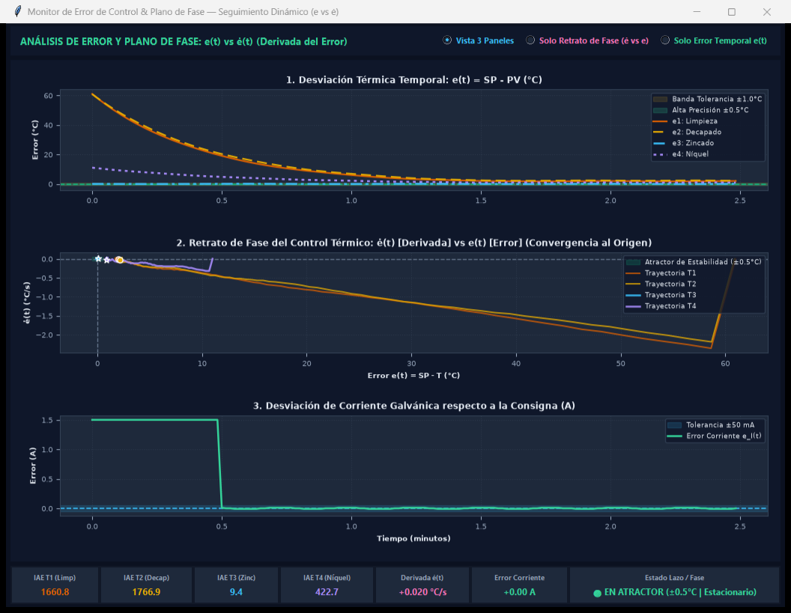
* **Descripción de la Interfaz:** Entorno de teoría de control en tiempo real para supervisar la estabilidad analítica de los 4 lazos cerrados PI.
* **Componentes Principales:**
  * **Gráfica Superior (Desviación Térmica Temporal):** Curvas de error e(t) = SP - PV en °C para cada tina convergiendo suavemente hacia la banda de alta precisión de ± 0.5°C.
  * **Gráfica Intermedia (Retrato de Fase en Espacio de Estados):** Diagrama de/dt vs. e(t) donde las trayectorias espirales colapsan hacia el atractor de estabilidad en el origen (0, 0).
  * **Gráfica Inferior (Desviación de Corriente VCSS):** Error de corriente en Amperes respecto a la consigna nominal.
  * **Métricas IAE y Diagnóstico de Estado:** Contadores numéricos de IAE acumulado (T1: 1660.8, T2: 1766.9, T3: 9.4, T4: 422.7 °C·s), derivada térmica instantánea (+0.020°C/s), error de corriente (+0.00 A) y confirmación de estabilidad: `🟢 EN ATRACTOR (±0.5°C | Estacionario)`.

---

##### 4. Ventana Modular: Balanza Gravimétrica y Rendimiento de Corriente ([`scada_04_faraday.png`](imagenes/scada_04_faraday.png))
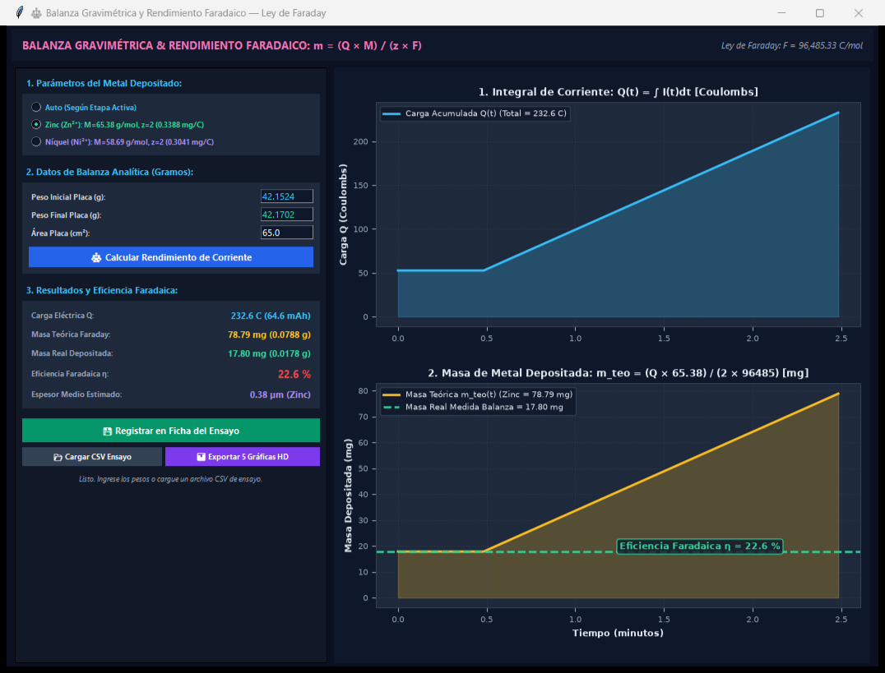
* **Descripción de la Interfaz:** Módulo analítico para procesar las pesadas de laboratorio y verificar la cinética electroquímica según las Leyes de Faraday.
* **Componentes Principales:**
  * **Formulario de Entradas de Laboratorio:** Selector de metal (Zinc Zn²⁺, Níquel Ni²⁺ o Auto), campos numéricos para peso inicial en balanza analítica (42.1524 g), peso final con recubrimiento seco (42.1702 g) y área sumergida de la probeta (65.0 cm²).
  * **Resultados de Carga Eléctrica Calculados:** Carga eléctrica integrada (Q = 232.6 C / 64.6 mAh), masa teórica de Faraday (m(teo) = 78.79 mg), masa real experimental depositada (Δ m = 17.80 mg), eficiencia de corriente (η = 22.6%) y espesor medio estimado (0.38 μm).
  * **Lienzos Gráficos Integrados:** (1) Acumulación cronológica de carga eléctrica Q(t) = ∫ I(t)dt en Coulombs y (2) Curva de masa teórica creciente vs. línea horizontal de masa experimental medida gravimétricamente.

---

##### 5. Ventana Modular: Calibración y Verificación de pH Dual ([`scada_05_ph.png`](imagenes/scada_05_ph.png))
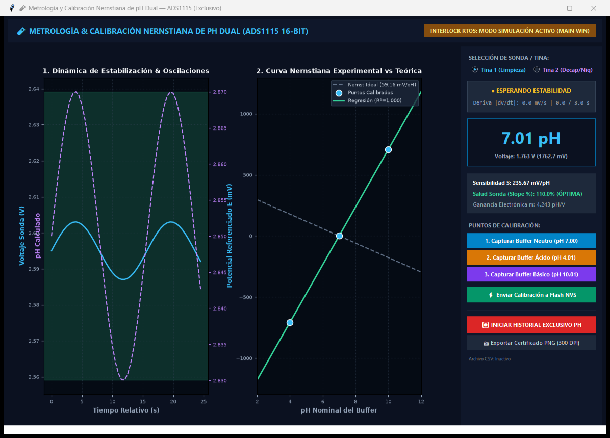
* **Descripción de la Interfaz:** Módulo de calibración para verificar las sondas de electrodo de vidrio con el convertidor ADS1115.
* **Componentes Principales:**
  * **Gráfico 1 (Dinámica de Estabilización y Oscilaciones):** Traza el potencial analógico bruto en Voltios y el pH calculado en tiempo real para verificar el criterio de estabilidad |dV/dt| < 10 mV durante 3 segundos antes de registrar el punto.
  * **Gráfico 2 (Curva Nernstiana Experimental vs. Teórica):** Recta de regresión sobre los tampones patrón de pH 4.01, 7.00 y 10.01 comparada contra la pendiente ideal de Nernst (59.16 mV/pH a 25°C), certificando R² = 1.000.
  * **Panel de Control y Diagnóstico de Sonda:** Indicador digital de alta visibilidad (`6.99 pH`, 1.767 V), cálculo de sensibilidad experimental (235.67 mV/pH), diagnóstico de salud de la sonda (`Slope: 110.0% ÓPTIMA`), botones de captura de buffers, botón de guardado en la memoria Flash NVS del ESP32 y exportación de certificados de calibración a 300 DPI.

---

##### 6. Ventana Modular: Diagnóstico de Hardware, Buses y Auditoría de Incidentes ([`scada_06_diagnostico.png`](imagenes/scada_06_diagnostico.png))
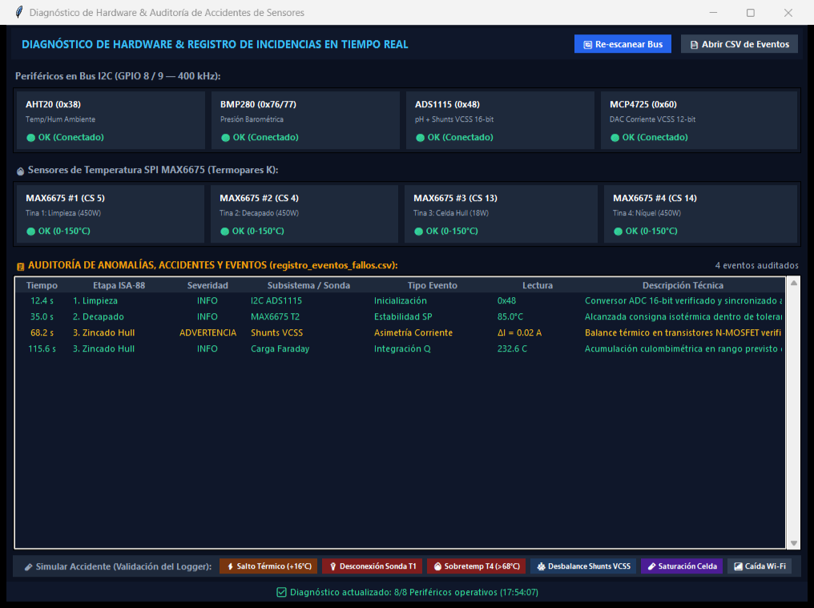
* **Descripción de la Interfaz:** Tablero de supervisión de bajo nivel del hardware embebido, estado de los buses I2C/SPI y registro en tiempo real de anomalías operativas.
* **Componentes Principales:**
  * **Tarjetas de Estado de Periféricos I2C (GPIO 8/9 — 400 kHz):** Monitoreo de AHT20 (`0x38`), BMP280 (`0x76/77`), ADS1115 (`0x48`) y MCP4725 (`0x60`), todos con estado `🟢 OK (Conectado)`.
  * **Tarjetas de Termopares SPI MAX6675 (CS 5, 4, 13, 14):** Monitoreo de continuidad eléctrica de los termopares de T1 a T4, con estado `🟢 OK (0-150°C)`.
  * **Tabla de Auditoría de Incidentes en Tiempo Real:** Lista cronológica con severidad codificada por colores (`INFO`, `ADVERTENCIA`, `CRÍTICO`) donde se auditan eventos como sincronización de ADC a 860 SPS, alcance de estabilidad isotérmica, balance térmico en shunts de corriente y carga acumulada.
  * **Barra de Pruebas de Auditoría:** Botones para simular perturbaciones controladas (salto térmico de +16°C, desconexión de sonda T1, sobretemperatura en T4, desbalance de shunts VCSS) para validar el comportamiento del logger y las alarmas de seguridad antes de los ensayos químicos.

---

### 4.2 Suite de Graficación Científica Post-Ensayo a 300 DPI (`software/exportar_graficas_offline.py`)

> [!IMPORTANT]
> **CLARIFICACIÓN ARQUITECTÓNICA: SUPERVISIÓN SCADA EN VIVO vs. SUITE DE GRAFICACIÓN CIENTÍFICA**  
> * **1. Entorno SCADA de Escritorio en Tiempo Real (Sección 4.1):** Sistema interactivo optimizado para supervisión viva y control a **10 Hz**. Debido a que un ensayo continuo puede prolongarse durante horas, mantener en memoria viva millones de muestras generaría fugas de memoria RAM y congelaría la interfaz gráfica. Por ello, opera con una **memoria intermedia circular FIFO (buffer deslizante limitado)** que refresca únicamente la ventana temporal más reciente.  
> * **2. Suite Científica Post-Proceso a 300 DPI (Esta Sección 4.2):** Se ejecuta una vez concluido el ensayo leyendo directamente el archivo CSV íntegro almacenado en el disco duro. **No posee limitación de buffer**, por lo que procesa de principio a fin **la totalidad del experimento (todos los 1200+ segundos / 20+ minutos de datos)**. Esto permite calcular integrales analíticas continuas (energía en Wh, carga eléctrica total Q, índice IAE acumulado), modelar envolventes de los 72,000 ciclos senoidales a 60 Hz y compilar hasta 8 figuras compuestas de resolución editorial a 300 DPI.  
> * *En resumen: el SCADA le permite operar y controlar la planta en el presente; la Suite de Graficación le permite auditar, certificar y documentar el pasado histórico completo del proceso.*

> [!WARNING]
> **Nota sobre Gráficas Demostrativas:**  
> Todas las curvas, oscilogramas y gráficas científicas expuestas en esta sección son de carácter **estrictamente demostrativo y educativo**. Fueron generadas mediante modelos numéricos y datos simulados para exhibir la capacidad analítica de la plataforma y no corresponden a ningún proceso químico real ni lote industrial de producción.

#### 4.2.1 Compilador Automatizado y Flujo de Trabajo
Al concluir un ensayo, el investigador ejecuta el motor científico mediante:
```bash
python software/exportar_graficas_offline.py
# O alternativamente procesar directamente la carpeta del ensayo:
python software/exportar_graficas_offline.py --experimento "software/telemetria2.0/experimentos/Ensayo_2026-09-12_14-30-00" --dpi 300
```
El compilador lee el CSV sin pérdida de resolución temporal, calcula derivadas térmicas, integra energía activa y genera los archivos vectoriales y rasterizados de alta densidad que se detallan a continuación.

---

#### 4.2.2 Perfil Electroquímico y Térmico Multizona ([`01_perfil_electroquimico_termico.png`](imagenes/01_perfil_electroquimico_termico.png))
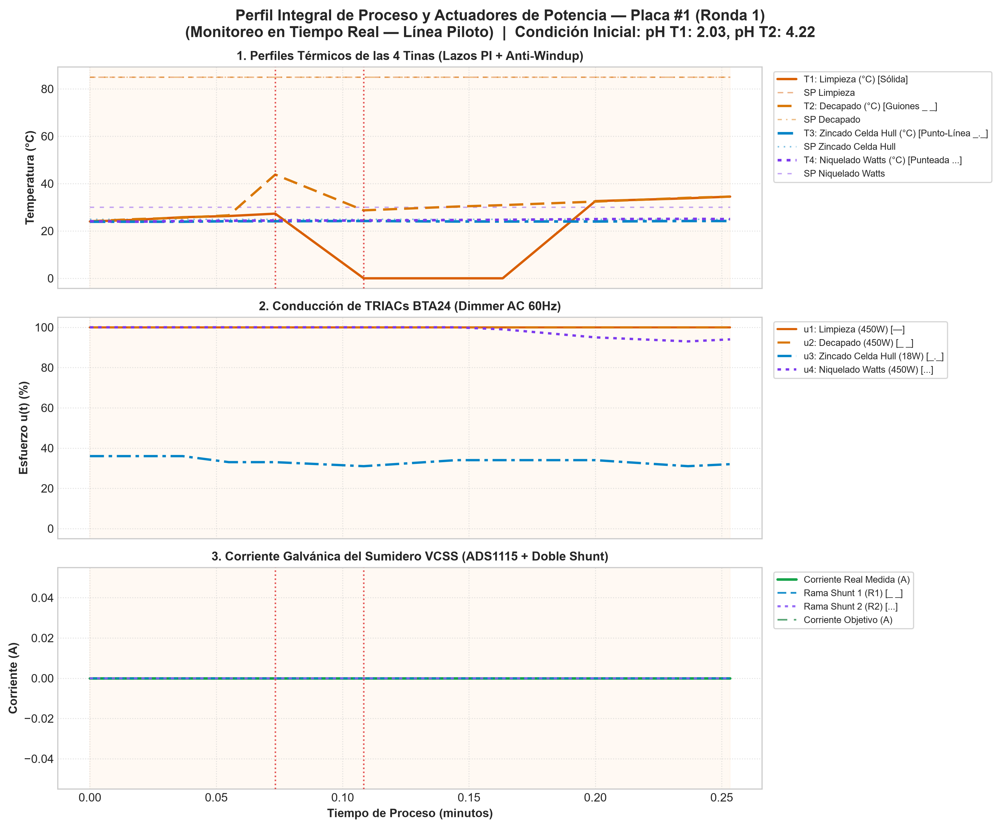
* **📌 ¿Por qué se añade esta gráfica?:** Es el documento central de validación fisicoquímica del proceso completo. Permite verificar que cada tina alcanzó su temperatura de consigna antes de autorizar la inmersión de la probeta, y que la corriente se mantuvo estable sin caídas durante toda la fase de electrodeposición.
* **📊 ¿Qué representa?:** Dos paneles sincronizados a lo largo de 1200 segundos (20 minutos): el panel superior traza las curvas de temperatura de las 4 tinas (°C) contrastadas contra sus consignas punteadas; el panel inferior muestra la corriente real (A) frente a la consigna del sumidero VCSS.
* **📖 ¿Cómo se lee e interpreta?:**
  * *Calentamiento Inicial:* Rampas de subida suaves con pendientes de 1.5 a 2.0°C/min y sobretiro prácticamente nulo (*overshoot* < 0.8°C).
  * *Meseta Isotérmica:* Las 4 temperaturas se aplanan dentro de la franja de tolerancia (± 0.5°C).
  * *Escalón de Corriente:* Arranque suave (*Soft-Start* de 500 ms) y meseta perfectamente horizontal durante los 10 minutos de electrólisis.
  * *Diagnóstico de Anomalías:* Caídas térmicas bruscas indican adición imprevista de agua fría o retiro de tapas; fluctuaciones en la corriente indican pasivación del ánodo o falsos contactos.

---

#### 4.2.3 Seguimiento de Errores de Control e Índice Acumulativo IAE ([`02_seguimiento_errores_control.png`](imagenes/02_seguimiento_errores_control.png))
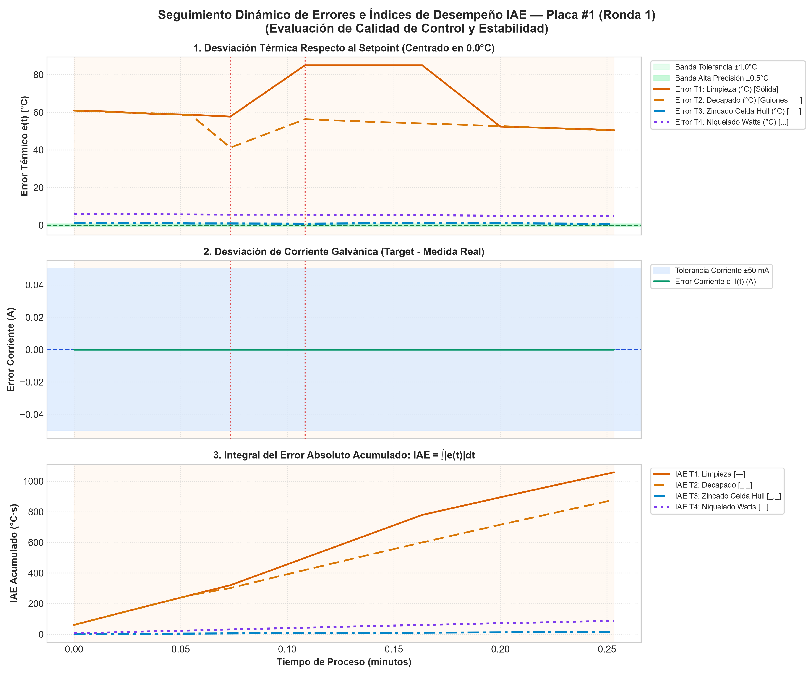
* **📌 ¿Por qué se añade esta gráfica?:** Proporciona la métrica matemática más estricta de la ingeniería de control para calificar el desempeño del lazo cerrado. Mientras que una curva de temperatura puede disimular desviaciones leves, el índice integral IAE (∫₀^t |e(τ)| dτ) acumula cualquier desvío en el tiempo, permitiendo certificar la sintonía PI sin sesgos visuales.
* **📊 ¿Qué representa?:** Dos paneles apilados: el superior grafica el error instantáneo e(t) = SP - T(t) en °C con su banda de tolerancia (± 0.5°C); el inferior muestra la curva monótona creciente de acumulación de error IAE en [°C · s] para cada tina.
* **📖 ¿Cómo se lee e interpreta?:**
  * *Error Instantáneo:* Al arrancar desciende desde un error alto (ej. +60°C) y converge a la franja de ± 0.5°C centrada en cero.
  * *Índice IAE:* Sube durante la fase de calentamiento, pero una vez alcanzada la consigna **debe aplanarse totalmente y convertirse en una línea horizontal**.
  * *Diagnóstico de Anomalías:* Si la curva IAE continúa ascendiendo con pendiente constante durante el régimen permanente, delata un error de estado estacionario no corregido por falta de ganancia integral Kᵢ.

---

#### 4.2.4 Esfuerzo de Control de TRIACs y Potencia RMS ([`03_actuadores_triacs_potencia.png`](imagenes/03_actuadores_triacs_potencia.png))
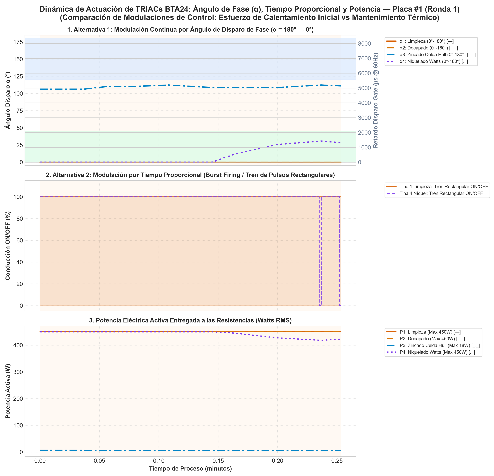
* **📌 ¿Por qué se añade esta gráfica?:** Para auditar el estrés eléctrico y térmico soportado por los semiconductores de potencia (TRIACs BTA24-600B) y verificar la potencia real consumida en Watts por las resistencias calefactoras sin requerir instrumental externo.
* **📊 ¿Qué representa?:** Tres paneles sincronizados: ángulo de retardo de disparo α(t) en grados (0° a 180°), tensión eficaz cuadrática V(RMS)(t) aplicada sobre la resistencia y potencia activa disipada P(t) = V(RMS)² / R en Watts para cada tina.
* **📖 ¿Cómo se lee e interpreta?:**
  * *Arranque:* α se sitúa en 0° a 25°, produciendo V(RMS) ≈ 115 a 120 V y P ≈ 450 W (plena potencia nominal).
  * *Régimen Permanente:* α se abre progresivamente a 120° a 140°, la tensión eficaz cae a 45 a 55 V y la potencia se reduce a 70 a 90 W (compensación exacta de pérdidas térmicas).
  * *Diagnóstico de Anomalías:* Si la potencia permanece fija al 100% y la temperatura no sube, la resistencia calefactora está abierta o desconectada.

---

#### 4.2.5 Macro-Conmutación de TRIACs a lo largo de Todo el Proceso ([`03b_macro_conmutacion_4tinas_proceso_completo.png`](imagenes/03b_macro_conmutacion_4tinas_proceso_completo.png))
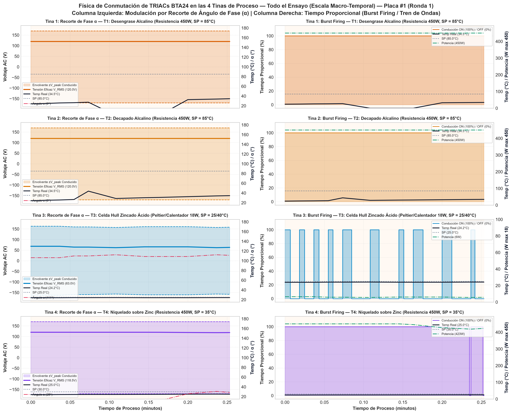
* **📌 ¿Por qué se añade esta gráfica?:** En sistemas de control convencionales, solo se grafica la curva de temperatura (T vs. t). Dicha curva únicamente muestra la variable de salida (PV), pero **oculta por completo la dinámica interna del actuador**: no revela si los TRIACs operaron saturados, si sufrieron conmutaciones parásitas violentas (*chattering*), o si el algoritmo PI introdujo oscilaciones encubiertas de potencia. Esta figura brinda una **auditoría completa de las 4 tinas a lo largo de los 1200 segundos del proceso**.
* **📊 ¿Qué representa?:** Una matriz comparativa de 4 Filas (las 4 cubas) &times; 2 Columnas:
  * *Columna Izquierda (Recorte de Ángulo de Fase α):* Muestra la envolvente instantánea conducida (± V(peak) = ± 170 V), la tensión cuadrática media V(RMS)(t) y el ángulo de disparo α(t) en grados.
  * *Columna Derecha (Tiempo Proporcional / Burst Firing ZCS):* Muestra los estados lógicos de conducción activa (100%) y reposo (0%) junto con la potencia disipada en Watts.
  * *Eje Gemelo Derecho:* Temperatura real medida en el seno del líquido por el termopar tipo K en °C (trazo continuo) comparada contra la consigna programada (línea punteada *setpoint*).
* **🔬 Física de la Portadora Senoidal de 60 Hz y Origen Óptico del «Bloque Rectangular Sólido»:**  
  En la red eléctrica de 60 Hz, cada ciclo senoidal completo dura exactamente 16.66 ms. A lo largo de un ensayo de 20 minutos (1200 s), ocurren exactamente **72,000 ciclos senoidales completos (144,000 excursiones entre +170V y -170V pico)**.
  En una pantalla estándar de 1920 píxeles de ancho, **un solo píxel horizontal abarca más de 37 ciclos senoidales completos**. Al trazar la tensión oscilando 60 veces por segundo, las líneas quedan tan densamente compactadas que se solapan físicamente: el ojo humano y la resolución gráfica perciben un **bloque rectangular sólido y homogéneo de color** entre +170 V y -170 V.
  Para modelar este fenómeno con máxima fidelidad sin congelar el procesador con 14.4 millones de puntos, el generador científico traza la **envolvente matemática de cresta (± V(peak)) con relleno sombreado (`fill_between`) y la curva eficaz V(RMS)(t)**.
* **📖 ¿Cómo se lee e interpreta la transición de 3 firmas geométricas?:**
  1. *El «Rectángulo Sólido» (Calentamiento al 95–100%):* Bloque denso en los primeros 300 a 500 s; el opto-TRIAC conduce ininterrumpidamente para romper la inercia térmica (450 W).
  2. *La «Zona Estriada / Código de Barras» (Transición y Frenado PI al 50%):* Franjas verticales alternadas con espacios en cero voltios al entrar la temperatura a la banda proporcional (|T - SP| ≤ 5°C).
  3. *Los «Pulsos Delgados Periódicos Espaciados» (Régimen Permanente al 15–20%):* El rectángulo desaparece; solo se aprecian pulsos delgados uniformes (70 a 90 W), certificando formalmente el **asentamiento térmico (± 0.5°C)**.

---

#### 4.2.6 Senoidales Modificadas por TRIAC en Escala Microscópica ([`03_senoidales_modificadas_periodos.png`](imagenes/03_senoidales_modificadas_periodos.png))
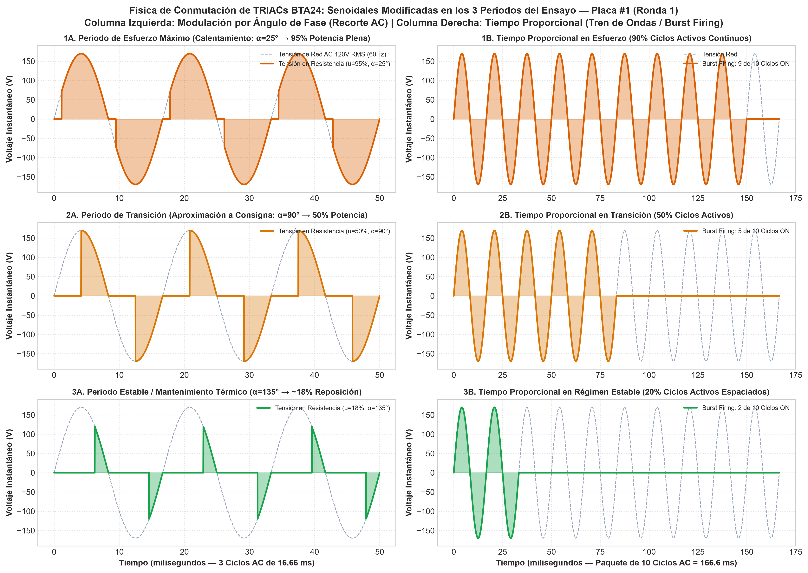
* **📌 ¿Por qué se añade esta gráfica?:** Proporciona la resolución temporal de un osciloscopio de laboratorio (0 a 50 ms) para inspeccionar la morfología íntima de la onda senoidal y contrastar el mecanismo físico del recorte de fase frente a los paquetes de ciclos enteros (Burst Firing).
* **📊 ¿Qué representa?:** La tensión instantánea v(t) en tres condiciones operativas: Esfuerzo Máximo (Calentamiento al 95%), Transición (Banda Proporcional al 50%) y Régimen Permanente (Asentamiento al 15%).
* **📖 ¿Cómo se lee e interpreta?:**
  * *Fila Recorte de Fase:* La onda permanece en 0V al cruzar por cero y salta abruptamente a la senoidal al alcanzarse el ángulo α. A mayor ángulo, menor área conducida y menor calor disipado.
  * *Fila Burst Firing:* Conduce ondas senoidales completas sin cortes intermedios, suprimiendo la emisión electromagnética (EMI).

---

#### 4.2.7 Análisis de Corriente y Electrodeposición ([`04_analisis_faraday_plano_fase.png`](imagenes/04_analisis_faraday_plano_fase.png))
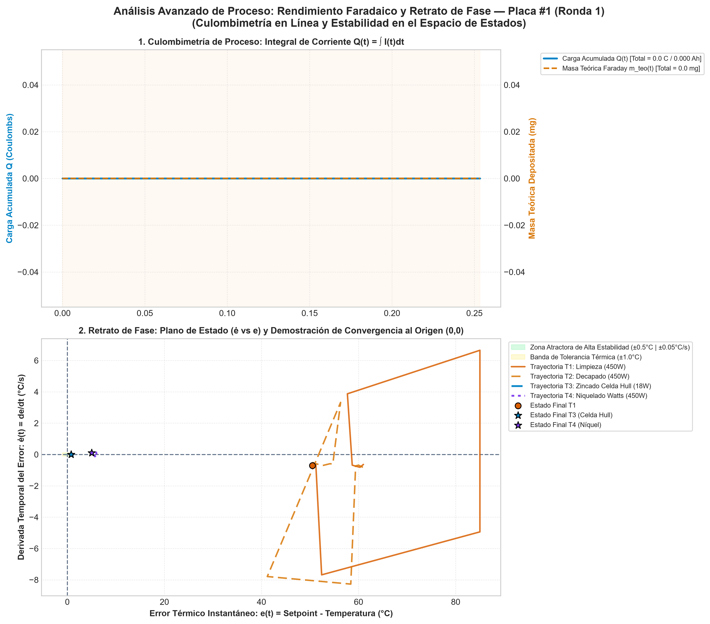
* **📌 ¿Por qué se añade esta gráfica?:** Es el entregable químico primordial para certificar la calidad del depósito metálico. Correlaciona la carga eléctrica consumida (Q = ∫ I dt), la masa teórica predicha por Faraday y la masa gravimétrica real pesada en balanza analítica, calculando la eficiencia de corriente (η%) y el espesor del depósito (μm).
* **📊 ¿Qué representa?:** Curva de acumulación de carga eléctrica en Coulombs (Q vs t), masa teórica vs. masa real en gramos (Δ m) e indicador porcentual de eficiencia de corriente (η%).
* **📖 ¿Cómo se lee e interpreta?:**
  * *Carga Eléctrica:* Línea recta con pendiente uniforme durante el paso de corriente (dQ/dt = I).
  * *Eficiencia de Corriente:* Valores esperados entre 90% y 98% para zincado ácido, y 85% a 95% para niquelado de Watts.
  * *Diagnóstico de Anomalías:* Rendimientos η < 80% indican sobrepotencial catódico excesivo con evolución violenta de hidrógeno gas (H₂ \uparrow) y riesgo de fragilización por hidrógeno.

---

#### 4.2.8 Dashboard Ejecutivo Post-Ensayo y Balance de Energía en Wh ([`05_diagnostico_integral_resumen.png`](imagenes/05_diagnostico_integral_resumen.png))
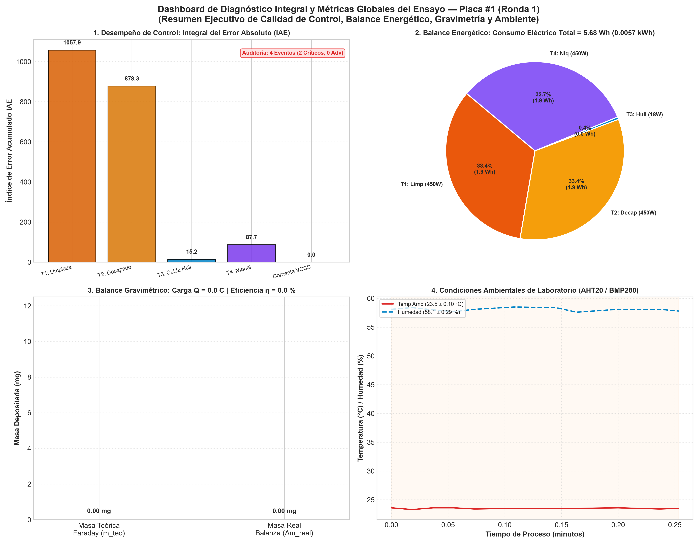
* **📌 ¿Por qué se añade esta gráfica?:** Condensa en un resumen gerencial único el balance técnico, el costo energético en KWh y los indicadores de desempeño (KPIs) para fines de auditoría técnica y control de calidad sin tener que inspeccionar archivos CSV crudos.
* **📊 ¿Qué representa?:** Gráfico de barras de consumo energético acumulado por tina en Watt-hora (Wh), radar de desempeño de control (IAE, tiempo de establecimiento, estabilidad de corriente) y tabla resumen de eventos.
* **📖 ¿Cómo se lee e interpreta?:**
  * *Distribución de Energía:* Tinas 1 y 2 (85°C) concentran el 80–90% de la energía total; Tina 3 (Celda Hull) registra un consumo mínimo (< 15 Wh).
  * *Radar de Control:* Cuanto mayor sea la superficie del polígono verde, mayor fue la excelencia del lazo.

---

#### 4.2.9 Cronograma Gantt de Etapas ISA-88 y Tiempos Muertos ([`06_tiempos_muertos_gantt_fases.png`](imagenes/06_tiempos_muertos_gantt_fases.png))
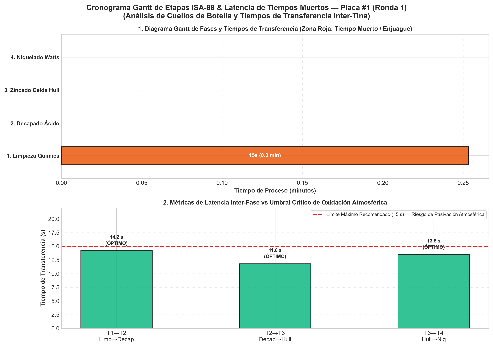
* **📌 ¿Por qué se añade esta gráfica?:** Audita la repetibilidad temporal de cada fase de tratamiento químico y los tiempos de transferencia aérea entre tinas, asegurando que no existan retrasos que provoquen pasivación superficial por exposición al oxígeno ambiental.
* **📊 ¿Qué representa?:** Diagrama cronológico de Gantt que mapea las etapas del proceso (Desengrase, Enjuagues, Decapado, Zincado, Niquelado) contra el tiempo en segundos y minutos, identificando tiempos activos de inmersión y tiempos de transferencia.
* **📖 ¿Cómo se lee e interpreta?:**
  * *Barras de Etapa:* Longitud idéntica a la programada en la matriz de recetas.
  * *Tiempos de Transferencia:* Las barras de transición deben ser inferiores a 15 segundos para evitar pasivación aérea de la probeta.

---

#### 4.2.10 Verificación de Corriente VCSS y Muestreo ETS a 10 Hz ([`08_metrologia_vcss_ets_pulsado.png`](imagenes/08_metrologia_vcss_ets_pulsado.png))
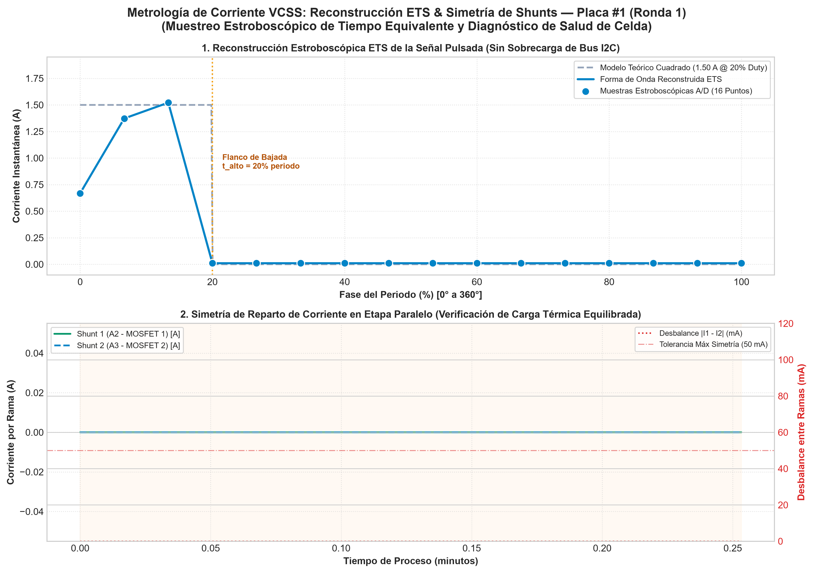
* **📌 ¿Por qué se añade esta gráfica?:** Audita la fidelidad del escalón de corriente del sumidero analógico regulado por el MCP4725 y el LM358, verificando que no existan sobreoscilaciones ni distorsiones por inductancia parásita de la cuba.
* **📊 ¿Qué representa?:** Reconstrucción a escala de milisegundos mediante la técnica ETS (*Equivalent Time Sampling*), contrastando la consigna analógica del DAC MCP4725 contra la corriente real sensada por el conversor ADS1115 de 16 bits sobre los shunts cerámicos de 10W.
* **📖 ¿Cómo se lee e interpreta?:**
  * *Tiempos de Flanco:* Subida (t_r < 1.0 ms) y bajada (t_f < 1.0 ms) con transiciones nítidas.
  * *Meseta del Pulso:* Horizontal y plana con error cuadrático inferior al 1.5%.

---

#### 4.2.11 Verificación de pH y Filtrado Digital Tri-Modo ([`08_filtro_ph_tri_modo.png`](imagenes/08_filtro_ph_tri_modo.png))
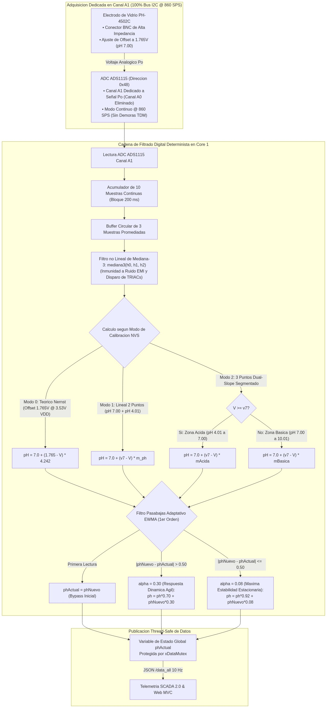
* **📌 ¿Por qué se añade esta gráfica?:** Garantiza la precisión de la medición de acidez en la Celda Hull de zincado ácido (pH nominal 2.0 a 4.0) y demuestra la efectividad del filtro digital eliminando spikes de conmutación sin retardar la respuesta.
* **📊 ¿Qué representa?:** El panel izquierdo muestra la recta de regresión de Nernst validando que la pendiente experimental sea ≥ 95% del valor teórico (59.16 mV/pH a 25°C); el panel derecho compara la señal ruidosa del electrodo de vidrio frente a la curva limpia del filtro de mediana y ventana móvil.
* **📖 ¿Cómo se lee e interpreta?:**
  * La pendiente experimental debe aproximarse a 59.16 mV/pH con R² ≥ 0.995.
  * La curva filtrada debe mantenerse suave y estable aún durante los disparos de corriente del sumidero VCSS.

---

## 5. Modelado y Cálculos de Eficiencia de Corriente y Espesor

El software ejecuta en tiempo real los balances de carga eléctrica y peso basados en las Leyes de Faraday:

### 1. Masa Real Depositada (Δ m(real)):
```text
Δm(real) = P(fin) - P(ini)   [g]
```

### 2. Carga Eléctrica Total Consumida (Q(total)):
Obtenida por integración trapezoidal numérica discreta en los registros de corriente del sumidero VCSS (N muestras a intervalo Δ t = 1.0 s):
```text
Q(total) = ∫₀^(t_total) I(t) dt ≈ Σ [ (Iₖ + Iₖ₋₁) / 2 ] · Δt   [Coulombs, C]
```

### 3. Masa Teórica de Faraday (m(teo)):
```text
m(teo) = (Q(total) · M) / (z · F)   [g]
```
Donde:
* M: Peso molecular del metal depositado (Zn = 65.38 g/mol, Ni = 58.69 g/mol).
* z: Valencia iónica del metal (z = 2 para Zn²⁺ y Ni²⁺).
* F: Constante de Faraday (96 485.33 C/mol).

### 4. Eficiencia de Corriente (η%):
```text
η = [ Δm(real) / m(teo) ] · 100%
```
*Valores típicos esperados:* 90% a 98% para zincado ácido; 85% a 95% para niquelado. Valores inferiores al 80% indican sobrepotencial con evolución parásita de hidrógeno gas (H₂ \uparrow).

### 5. Espesor Medio del Depósito (e):
```text
e = [ Δm(real) / (ρ · A) ] · 10⁴   [μm]
```
Donde:
* ρ: Densidad del metal (ρ_{Zn} = 7.14 g/cm³, ρ_{Ni} = 8.90 g/cm³).
* A: Área geométrica sumergida de la probeta (A = 100 cm² = 1.0 dm²).

---

## 6. Calibración de Instrumentación (pH, Temperatura y Corriente VCSS)

### 6.1 Calibración de Electrodos de pH (Canal A1 Dedicado ADS1115 · RTOS 2.0)

> [!IMPORTANT]
> **Arquitectura Metrológica RTOS 2.0 (Canal A1 Dedicado):**  
> En la versión **RTOS 2.0**, el antiguo Canal A0 fue completamente erradicado de la arquitectura de software y hardware para evitar retrasos por conmutación multiplexada en el convertidor ADS1115. El electrodo potenciométrico de pH opera con dedicación exclusiva en el **Canal A1** con el 100% de uso del bus I2C a **860 SPS**, permitiendo lectura continua e inmunidad a inyecciones de carga. Asimismo, los puntos de calibración se almacenan de manera desacoplada en memoria Flash NVS por modo de operación.

1. Conectar la computadora o dispositivo móvil a la red Wi-Fi emitida por la planta: `Uli` (clave: `12345678`).
2. Abrir en el navegador la dirección: `http://interfaz.local` (o `http://192.168.4.1`) y entrar a la vista [`ph.html`](http://192.168.4.1/ph.html) (o pestaña de Calibración en Telemetría 2.0).
3. **Ajuste de Offset de Hardware (PH-4502C):** Con la sonda en cortocircuito (o solución pH 7.00), girar el potenciómetro multivuelta del módulo PH-4502C hasta que el voltímetro digital y la aguja única del panel marquen exactamente 2.50 V (o 1.765 V según calibración del riel).
4. **Calibración Multipunto Asistida por Software (Guardado NVS):**
   * **Punto 1 (Neutro):** Enjuagar el electrodo con agua destilada, sumergir en solución amortiguadora **pH 7.00**, esperar a que la lectura ADC en Canal A1 se estabilice (± 2 mV) y presionar *Calibrar pH 7*.
   * **Punto 2 (Ácido):** Enjuagar y sumergir en amortiguador **pH 4.01**. Esperar y presionar *Calibrar pH 4*.
   * **Punto 3 (Alcalino):** Enjuagar y sumergir en amortiguador **pH 10.01**. Presionar *Calibrar pH 10*.
5. El firmware recalculará automáticamente la pendiente de Nernst (m ≈ -59.16 mV/pH) y los coeficientes por modo, guardándolos de forma permanente e independiente en la memoria interna Flash NVS (`memoria.putFloat`).

---

### 6.2 Verificación de Termopares Tipo K (MAX6675)

Los digitalizadores MAX6675 proporcionan compensación interna de unión fría y resolución de 0.25°C. Para verificar la cadena de medición completa (termopar + MAX6675 + firmware) se recomienda el siguiente procedimiento bianual o tras cualquier sustitución de sensor:

**Materiales Requeridos:**
* Vaso Dewar o termo aislante.
* Hielo triturado de agua destilada.
* Termómetro de referencia certificado (apreciación ≤ 0.5°C).

**Procedimiento de Verificación en 2 Puntos:**

| Punto | Referencia | Preparación | Criterio de Aceptación |
|:---:|:---|:---|:---|
| **1** (Hielo fundente) | 0.0°C | Llenar el vaso Dewar con hielo triturado de agua destilada hasta el borde. Agregar agua destilada hasta cubrir el hielo. Esperar 3 minutos a que el sistema alcance el equilibrio térmico. Sumergir la punta del termopar al menos 3 cm. | Lectura del MAX6675: 0.0 ± 1.5°C |
| **2** (Agua caliente) | T(ref) del termómetro certificado | Calentar agua destilada a \sim 80 a 90°C en un vaso de precipitados. Sumergir simultáneamente el termopar y el termómetro de referencia a la misma profundidad. Esperar 60 segundos de estabilización. | Diferencia: |T_{MAX6675} - T(ref)| ≤ 2.0°C |

> [!NOTE]
> **Corrección por Altitud (Punto de Ebullición):**  
> El punto de ebullición del agua disminuye ≈ 0.34°C por cada 100 m de altitud sobre el nivel del mar. Si el laboratorio se encuentra a una altitud significativa (ej. Ciudad de México a 2240 m.s.n.m., T_{eb} ≈ 92.4°C), utilice el termómetro de referencia como patrón en lugar del punto de ebullición teórico.

**Verificación por Software:**
* El bit D₂ del registro de 16 bits del MAX6675 indica la **detección de termopar roto o circuito abierto**. El firmware en `Modulo_Termico.cpp` lee este bit automáticamente y reporta la alarma `ERR_TC*_FAIL` (códigos 10–13) al módulo Supervisor.
* Para inspeccionar visualmente el estado de los 4 termopares, consultar la pantalla de **Diagnóstico de Hardware** del SCADA (Sección 4.1, Pantalla 6) o la vista web `sensores.html`.

---

### 6.3 Verificación del Sumidero de Corriente VCSS (Prueba Práctica con Multímetro)

Para auditar y verificar periódicamente la exactitud de la corriente inyectada por el sumidero analógico VCSS frente a la lectura digital del conversor ADS1115 de 16 bits y las resistencias de shunt cerámicas de 1.0 Ω / 10W, se establece el siguiente procedimiento de verificación:

**Instrumental Requerido:**
* Multímetro digital calibrado con escala de corriente continua de alta capacidad (**10 A o 20 A DC**).
* Puntas de prueba con caimanes reforzados de baja resistencia de contacto.
* Celda de prueba cargada con electrolito conductor o resistencia de carga de potencia (2.0 a 5.0 Ω / 50W).

**Procedimiento de Verificación en Serie:**
1. **Conexión del Circuito Amperimétrico:**
   * Con la celda apagada o el relé VCSS desenergizado, intercalar el multímetro digital en serie: conectar la sonda roja (borne 10A / 20A) al borne negativo de la probeta catódica de la celda y la sonda negra (borne `COM`) a la entrada `OUT-` de la etapa VCSS (retorno hacia los Drains de los MOSFETs IRLZ44N).
2. **Selección de Escala:**
   * Conmutar el selector del multímetro a **Corriente Continua DC (10A o 20A)**.
3. **Inyección de Corriente de Prueba:**
   * Desde la aplicación SCADA (`software/telemetria2.0/`) o desde la consola web móvil (`http://192.168.4.1/fuente.html`), fijar una consigna de prueba de **1.00 A** o **1.50 A DC** en modo continuo.
   * Activar el paso de corriente. Observar el arranque suave (*Soft-Start* de 500 ms) y aguardar 3 a 5 segundos para el asentamiento térmico del lazo PI de corriente.
4. **Criterio de Aceptación:**
   * Comparar la lectura real mostrada en la pantalla del multímetro patrón (I(patrón)) contra el valor reportado por el amperímetro digital del SCADA (I(SCADA)):
     ```text
|ΔI| = |I(patrón) - I(SCADA)| ≤ 0.03 A   (error ≤ 2.0%)
```
   * Si el error se mantiene dentro de ± 0.03 A, la respuesta de los MOSFETs IRLZ44N y la calibración de los shunts cerámicos se consideran **óptimas y verificadas**.
   * Concluida la prueba, cortar la corriente desde el software antes de retirar las puntas del multímetro para evitar chispas o arcos inductivos en los bornes.

---

## 7. Guía de Diagnóstico y Solución de Problemas (Química, Hardware y Firmware)

| Síntoma en Probeta / Celda | Causa Fisicoquímica Probable | Acción Correctiva de Laboratorio |
| :--- | :--- | :--- |
| **Depósito oscuro, pulverulento o quemado en bordes** | Densidad de corriente local excesiva (J > J_{límite}) o agotamiento de abrillantador. | Reducir la corriente en el SCADA o añadir 0.5 g/L de almidón soluble a la Tina 3. |
| **Falta de adherencia (desprendimiento o ampollas)** | Ataque deficiente en Tina 2 o retraso > 15 s entre Tina 2 y Tina 3 con re-oxidación pasiva. | Repetir decapado alcalino asegurando 85 {}°C y transferir inmediatamente a la Celda Hull. |
| **Picaduras o poros (*pitting*) en la superficie** | Burbujas de hidrógeno (H₂) adheridas a la probeta durante la electrodeposición. | Verificar que el pH no sea más ácido de 2.0 y agitar suavemente la celda para desprender burbujas. |
| **Coloración negra instantánea al sumergir en níquel** | Desplazamiento galvánico del zinc por falta de agente complejante. | Verificar la concentración de sulfato de sodio (Na₂SO₄ = 66.14 g/L) en la Tina 4. |
| **Alarma en SCADA: `CELDA_SATURADA`** | Resistencia de celda muy alta (R > 10 Ω), cables flojos o ánodo pasivado por capa aislante. | Limpiar superficialmente el ánodo de zinc/níquel con cepillo y verificar la sujeción de los caimanes. |

---

### 7.1 Tabla de Sintonía de Lazos PI Térmicos

Los parámetros de control proporcional-integral fueron obtenidos mediante sintonización analítica en MATLAB (`control/Control_termico.m`) con un margen de fase de **75°** (Kd = 0.0, respuesta críticamente amortiguada sin sobretiro). Los valores están codificados en [`Modulo_Termico.h`](../../firmware/esp32/RTOS2.0/Modulo_Termico.h) y son referenciados por `Modulo_Termico.cpp`:

| Canal | Tina | Calentador | Volumen | Kₚ | Kᵢ | Retardo θ | Banda Proporcional |
|:---:|:---|:---:|:---:|:---:|:---:|:---:|:---:|
| 0 | Desengrase Alcalino (T1) | 450 W | 1.0 L | **62.65** | **0.0897** | 6.0 s | ± 5°C |
| 1 | Decapado Alcalino (T2) | 450 W | 1.0 L | **62.65** | **0.0897** | 6.0 s | ± 5°C |
| 2 | Celda Hull Zincado (T3) | 18 W | 267 mL | **16.71** | **0.0239** | 3.0 s | ± 5°C |
| 3 | Niquelado Watts (T4) | 450 W | 1.0 L | **62.51** | **0.0895** | 6.0 s | ± 5°C |

**Parámetros del Lazo PI de Corriente VCSS** (codificados en [`config.h`](../../firmware/esp32/RTOS2.0/config.h)):

| Parámetro | Valor | Descripción |
|:---|:---:|:---|
| Kₚ (Corriente) | **0.12** | Ganancia proporcional para aproximación asintótica |
| Kᵢ (Corriente) | **0.04** | Ganancia integral para anulación de error estático |
| Blanking PI | 300 ms | Periodo de asentamiento analógico optimizado (acelera respuesta de 30s a <2.5s) |
| Soft-Start | 500 ms | Rampa suave de arranque contra sobrepicos inductivos |

> [!TIP]
> **Diagnóstico de Sintonía:**  
> Si la curva IAE (Sección 4.2.3) continúa ascendiendo con pendiente constante durante el régimen permanente, el valor de Kᵢ es insuficiente. Si se observa oscilación térmica periódica (± 2°C), reducir Kₚ un 20% e incrementar Kᵢ proporcionalmente.

---

### 7.2 Resolución de Anomalías de Hardware, Señal y Firmware

Durante la operación en laboratorio, ruidos por conmutación AC, falsos contactos o desconexiones pueden manifestarse en el sistema. A continuación se detallan las anomalías instrumentales más comunes y su protocolo de resolución:

| Síntoma en Pantalla / SCADA | Causa Física / Raíz | Acción Correctiva Inmediata | Prevención Técnica |
| :--- | :--- | :--- | :--- |
| **Spikes en termopar (± 20°C súbitos)** | Ruido de conmutación de TRIACs acoplado en cables de termopar no blindados o cercanía a cables de 120 VAC. | Separar al menos 10 cm los cables de los termopares de las líneas de alimentación de las resistencias calefactoras. | Mantener las trenzas de los termopares alejadas de los TRIACs; el firmware aplica filtro digital de mediana. |
| **Lectura NaN o 1024°C / `ERR_TC*_FAIL`** | Circuito abierto en el termopar Tipo K (cable desprendido o bornera de tornillo floja en el conversor MAX6675). | Apretar la bornera azul con destornillador perillero. Verificar continuidad eléctrica con multímetro. | El firmware detecta el bit D₂=1 y desactiva inmediatamente el TRIAC de esa tina por seguridad (Failsafe). |
| **Alarma `ERR_UART_NANO_TIMEOUT`** | Ausencia de tramas serie del Arduino Nano por > 3000 ms (cable RX suelto o microcontrolador sin energía). | Revisar el cable Dupont entre el pin TX (GPIO 17) del ESP32 y el pin RX (D0) del Nano, así como la alimentación de +5V. | El Arduino Nano apaga automáticamente los 4 TRIACs tras 3 s sin comunicación para evitar sobrecalentamiento. |
| **Alarma `CELDA_SATURADA`** | Resistencia de celda > 10 Ω, bornes flojos o ánodo de zinc/níquel pasivado por capa aislante. | Limpiar superficialmente los ánodos con cepillo de cerdas duras y asegurar el apriete de los caimanes de celda. | Monitorear la tensión de la celda; no exceder la distancia geométrica recomendada de electrodos. |
| **Interferencia en pH al activar corriente VCSS** | Acoplamiento parásito a través del electrolito o inyección de carga en el ADS1115 si ambos canales se leen simultáneamente. | Desconectar o pausar la sonda de pH antes de iniciar la electrólisis. | Cumplir el protocolo: medir y ajustar pH en reposo a temperatura ambiente, retirar sonda y guardarla en KCl 3M. |
| **Baliza Neopixel en Rojo (4 Hz / Estrobo)** | Peligro físico crítico: Sobrecalentamiento (>SP+5°C), sobrecorriente VCSS (>3.5 A) o watchdog FreeRTOS. | Verificar nivel de líquido, comprobar shunts y reiniciar alarma en SCADA. | Corte Failsafe automático de TRIACs y celda. |
| **Baliza Neopixel en Rojo (1 Hz / Parpadeo)** | Falla de sensor o enlace: Termopar abierto (D₂=1), pérdida I2C o timeout UART con Arduino Nano. | Revisar apriete de bornera MAX6675 y cables TX/RX del Nano. | Desconexión por seguridad de la tina o actuador afectado. |
| **Baliza Neopixel en Ámbar (Fijo)** | Sensores ambientales AHT20/BMP280 no detectados en bus I2C (GPIO 8/9). | Revisar cables Dupont de 3.3V, GND, SDA y SCL del sensor. | El proceso térmico y de electrodeposición continúa operando con normalidad. |

#### Baliza LED RGB — Código de Estados (Supervisor FreeRTOS en Tiempo Real · Core 1 · 13 Códigos):

La baliza Neopixel WS2812 (GPIO 48) es comandada en tiempo real por la tarea `Task_Supervisor` en Core 1 del microcontrolador maestro. Cada color y patrón estroboscópico refleja el estado de seguridad, enlaces de comunicación y los procesos activos de la planta:

| Prioridad | Estado Operativo | Color y Cadencia LED | Significado Físico / Condición de Planta |
| :---: | :--- | :--- | :--- |
| **P0** | **Peligro Físico Crítico** | 🔴 **Rojo (4 Hz)** *(Estrobo violento)* | Sobrecalentamiento (>SP+5°C), sobrecorriente VCSS (>3.5 A) o watchdog FreeRTOS disparado. Apagado Failsafe total. |
| **P1** | **Falla Sensor / Enlace** | 🔴 **Rojo (1 Hz)** *(Parpadeo lento)* | Termopar abierto (TC0..TC3), pérdida I2C (ADS1115/MCP4725) o timeout con Arduino Nano (>3000 ms). |
| **P2** | **Actualización OTA** | ⚪ **Blanco (Rápido)** *(10 Hz)* | Actualizando firmware vía Web (`/update`). ¡No apagar ni desconectar la alimentación! |
| **P3** | **Modo Banco de Pruebas** | 🟣 **Púrpura** *(Respiración)* | Placa en desarrollo: 0 sensores de planta detectados y conexión USB Serial activa. |
| **P4** | **Calibración de pH** | 💖 **Magenta** *(Fucsia respiración)* | Sonda en solución tampón; ajuste de offset y pendiente en curso. |
| **P5A** | **Térmico + VCSS Pulsado** | ⚡ **Cian / Azul** *(Base azul + pulsos)* | Sistema térmico activo + corriente modulada en tren de pulsos. |
| **P5B** | **Térmico + VCSS Continuo** | 💎 **Cian (Fijo)** | Sistema térmico activo + salida de corriente continua (DC). |
| **P5C** | **Sistema Térmico Activo** | 🔵 **Azul (Fijo)** | Control térmico PI activo en los reactores/tinas. |
| **P5D** | **Salida de Corriente Pulsada** | 🔹 **Celeste (Pulsante)** | Electrodeposición por pulsos activa. |
| **P5E** | **Salida de Corriente Continua (DC)** | 🔹 **Celeste (Fijo)** | Corriente continua estable VCSS activa (DAC MCP4725). |
| **P6** | **Sensores Ambientales Ausentes** | 🟡 **Ámbar (Fijo)** | Sensores ambientales AHT20/BMP280 no detectados; sistema operable. |
| **P7** | **Sistema en Reposo (Conectado)** | 🟢 **Verde (Fijo)** | Todo OK. Operador conectado por Wi-Fi; planta en espera sin comandos activos. |
| **P8** | **En Espera de Conexión Wi-Fi** | 🟢 **Verde (Destello)** *(Faro cada 2.5s)* | Red Wi-Fi SoftAP "Uli" emitiendo baliza; esperando conexión del usuario. |

---

## 8. Seguridad Química y Gestión de Residuos

### Equipo de Protección Personal (EPP) Obligatorio:
* **Gafas de seguridad** con protección lateral contra salpicaduras químicas (Norma ANSI Z87.1).
* **Bata de laboratorio** de algodón de manga larga (100% resistente a ácidos y álcalis).
* **Guantes de nitrilo resistentes a químicos** (evitar látex simple; cambiar inmediatamente si hay contacto con soluciones a 90°C).
* **Calzado cerrado de seguridad**.

### Manipulación de Baños Calientes (Tinas 1 y 2 a 85–90°C):
* Las tinas de desengrase y decapado operan cerca del punto de ebullición. **Nunca agregar agua fría de golpe a tinas calientes** para evitar proyecciones por evaporación violenta.
* Mantener encendido el extractor de aire del laboratorio para evacuar vapores de fosfatos y humedad.

### Manejo y Neutralización de Residuos Metálicos (Zn²⁺, Ni²⁺):
* Las sales de níquel (Ni²⁺) están catalogadas como tóxicas para organismos acuáticos y alérgenos dérmicos.
* **Prohibido verter al drenaje:** Todos los enjuagues y baños agotados deben confinarse en contenedores etiquetados como *Residuos Peligrosos Líquidos Inorgánicos*.
* Para tratamiento de desecho:
  1. Precipitar los metales como hidróxidos insolubles ajustando a pH 9.5 a 10.0 con lechada de cal (Ca(OH)₂) o NaOH al 10%.
  2. Filtrar el lodo de hidróxidos metálicos (Ni(OH)₂, Zn(OH)₂) para disposición como residuo sólido peligroso.
  3. Neutralizar el sobrenadante líquido a pH 7.0 antes de su disposición autorizada.

### 8.1 Nota sobre Gráficas Demostrativas:
* **Carácter Ilustrativo:** Todas las figuras, curvas de respuesta térmica, retratos de fase, oscilogramas de TRIACs y balances electroquímicos presentados a lo largo de este manual son **estrictamente demostrativos e ilustrativos**.
* **Propósito:** Fueron generados a partir de modelos sintéticos y pruebas algorítmicas de software para capacitación técnica y validación del renderizado a 300 DPI. **No representan ni corresponden a ningún proceso químico, industrial o ensayo experimental real en particular**.
* **Ensayos Reales:** Los datos e informes definitivos de cada ensayo experimental deben generarse de forma obligatoria a partir de los archivos CSV registrados en vivo por la estación SCADA.

---

## 9. Arquitectura del Software, Librerías y Entornos de Desarrollo

Para desarrolladores, ingenieros de software o investigadores interesados en auditar o extender el sistema de control, a continuación se detallan la organización modular, disposición exhaustiva de carpetas, arquitectura del firmware C++, entorno de pruebas web, herramientas matemáticas en MATLAB, diseño de hardware, instaladores de librerías y la recomendación de uso de **Antigravity IDE**.

---

### 9.1 Disposición Completa y Exhaustiva de Carpetas del Proyecto (Versión 2.0)

El repositorio está estructurado bajo una estricta separación de responsabilidades de control determinista en tiempo real, potencia eléctrica de corriente alterna, simulación físico-química, supervisión SCADA y documentación técnica:

```text
Proyecto/
├── Iniciar_Sistema.bat        # 🚀 Panel Maestro: Menú interactivo para todos los módulos
├── Iniciar_Telemetria_2.0.bat # 🚀 Acceso Directo: SCADA en vivo activo (RTOS 2.0)
├── requirements.txt           # Dependencias Python (requests, pandas, matplotlib, numpy, openpyxl)
├── README.md                  # Documento maestro con resumen de arquitectura y especificaciones (v2.0)
├── AGENTS.md                  # Reglas de estilo y desarrollo
│
├── firmware/                  # 🧠 CÓDIGO FUENTE DE MICROCONTROLADORES
│   ├── esp32/                 # Nodo Maestro (SoC Espressif ESP32-S3 N16R8 Dual-Core 240 MHz)
│   │   ├── RTOS2.0/           # ⭐ FIRMWARE ACTIVO (Canal A1 dedicado ADS1115, FreeRTOS SMP v2.0.0)
│   │   │   ├── RTOS2.0.ino    # Punto de entrada Arduino: setup(), init buses y creación de tareas RTOS
│   │   │   ├── config.h       # Mapeo de hardware, GPIOs, direcciones I2C/SPI/UART y constantes VCSS
│   │   │   ├── RTOS_Core.h    # Estructuras de estado global y manejadores de sincronización
│   │   │   ├── RTOS_Core.cpp  # Atomic Snapshots thread-safe bajo xDataMutex
│   │   │   │
│   │   │   ├── Task_Fuente.h / .cpp       # Tarea determinista del lazo VCSS en Core 1
│   │   │   ├── Modulo_Fuentes.h / .cpp    # Driver de hardware del sumidero VCSS (MCP4725 y shunts ADS1115)
│   │   │   ├── Modulo_Fuente_DC.h / .cpp  # Lazo cerrado continuo DC con Soft-Start (500 ms) y Blanking (300 ms)
│   │   │   ├── Modulo_Fuente_Pulsado.h / .cpp # Modulador de pulsos galvánicos y muestreo ETS de 16 puntos
│   │   │   ├── Controller_Fuente.h / .cpp # Endpoints REST (/modo_f, /set_comp_f, /cal_vcss, etc.)
│   │   │   │
│   │   │   ├── Task_Termico.h / .cpp      # Supervisión térmica multizona en Core 1 y despacho UART
│   │   │   ├── Modulo_Termico.h / .cpp    # Driver SPI multiplexado de 4 MAX6675 y detección bit D2
│   │   │   ├── Controller_Termico.h / .cpp # Endpoints REST térmicos y consignas
│   │   │   │
│   │   │   ├── Task_Sensado.h / .cpp      # Coordinador periódico de sensado analógico
│   │   │   ├── Modulo_PH.h / .cpp         # Sensor de pH DEDICADO Canal A1 (A0 eliminado, 860 SPS, NVS por modo)
│   │   │   ├── Controller_PH.h / .cpp     # Endpoints REST de pH y asistente de calibración multipunto NVS
│   │   │   │
│   │   │   ├── Modulo_Ambiental.h / .cpp  # Sensado I2C de meteorología de cabina (AHT20 / BMP280)
│   │   │   ├── Task_Supervisor.h / .cpp   # Watchdog de tareas, enclavamiento Fail-Safe Latch y baliza RGB
│   │   │   ├── Controller_System.h / .cpp # Endpoints REST de salud y reset fail-safe (/data_all, /failsafe_reset)
│   │   │   ├── Task_Web.h / .cpp          # Servidor HTTP no bloqueante en Core 0
│   │   │   ├── WebServer_App.h / .cpp     # Registro de rutas REST, Server-Sent Events y despacho de vistas
│   │   │   ├── Modulo_OTA.h / .cpp        # Actualización de firmware inalámbrica Over-The-Air (/update)
│   │   │   │
│   │   │   └── views/                     # Vistas web HTML5/CSS/JS embebidas en memoria Flash PROGMEM:
│   │   │       ├── View_Menu.h            # Tablero principal de navegación con meteorología en vivo
│   │   │       ├── View_Termico.h         # Control térmico de 4 tinas y barras de modulación TRIAC
│   │   │       ├── View_Fuente.h          # Amperímetro digital, barra VU y selector de modos VCSS
│   │   │       ├── View_PH.h              # Monitor de pH dedicado Canal A1 y calibración Flash NVS
│   │   │       ├── View_Sensores.h        # Diagnóstico de 8 dispositivos en buses I2C/SPI y baliza RGB
│   │   │       └── View_Consola.h         # Terminal serie interactiva embebida con filtros de severidad
│   │   │
│   │   └── historico/         # Archivo consolidado de versiones previas (RTOS 1.0 a 1.4 y Super-Loop v3.5/v4.0)
│   │
│   └── arduino_nano/          # Nodo Esclavo de Potencia AC 60 Hz (Microchip ATmega328P)
│       ├── nano/              # Firmware activo en producción:
│       │   └── nano.ino       # Interrupción INT1 (Pin D3 cruce por cero), LUT 101 puntos, disparo TRIACs y WDT
│       └── historico/         # Prototipos previos (Nano Beta y nano2 con JELDimmer2)
│
├── software/                  # 📊 APLICACIONES SCADA, TELEMETRÍA Y PROCESAMIENTO
│   ├── telemetria2.0/         # ⭐ SCADA ACTIVO (Matriz ISA-88, Culombimetría, Balanza analítica, Canal A1)
│   ├── telemetria/            # SCADA v1.0 (Versión base de referencia)
│   └── exportar_graficas_offline.py # Generador offline de 8 figuras científicas (300 DPI)
│
├── hardware/                  # 🔌 ELECTRÓNICA, ESQUEMAS Y MODELADO
│   ├── esquemas_y_bom/        # Lista de materiales (BOM.md), esquemático VCSS y diagrama integral
│   └── control_matlab/        # Modelado matemático en MATLAB (Control_termico.m y graficar_matlab.m)
│
├── documentos/                # 📚 DOCUMENTACIÓN TÉCNICA, QUÍMICA Y ACADÉMICA
│   ├── academicos/            # Tesis de licenciatura, Cartel, Protocolo VUGR y Plantilla SMEQ26
│   ├── manuales/              # Manual interactivo (HTML, PDF y Markdown)
│   ├── guias/                 # Guía de compilación Arduino IDE, Changelog y generador PDF
│   ├── datasheets/            # 15 hojas de datos oficiales de sensores y componentes
│   ├── imagenes/              # Figuras científicas HD y capturas del SCADA
│   └── instaladores/          # Scripts de instalación desatendida (Python y librerías Arduino)
│
├── visualizacion/             # 🌐 INTERFACES WEB Y DIAGRAMAS TÉCNICOS
│   ├── diagramas/             # Visor interactivo y diagramas de arquitectura del firmware
│   └── preview/               # Hub de previews y simuladores web de las pantallas del ESP32 (RTOS 2.0)
│
└── herramientas/              # 🛠️ UTILIDADES Y SCRIPTS AUXILIARES
    ├── lanzadores/            # Accesos directos .bat individuales para cada componente
    └── scratch/               # Banco de pruebas y scripts de verificación experimental
```

#### Resumen Modular del Repositorio:

| Módulo / Directorio | Lenguaje | Rol en el Sistema | Archivos Clave y Funcionalidad |
| :--- | :--- | :--- | :--- |
| **`firmware/esp32/RTOS2.0/`** | C++ / FreeRTOS SMP | Nodo Maestro: Supervisión, red WiFi, servidor web y control determinista en Core 1. | 40 archivos fuente (`.cpp/.h`) + 6 vistas embebidas en `views/` (Control VCSS, supervisión térmica PI, sensor pH dedicado Canal A1 en ADS1115, NVS por modo y OTA). |
| **`firmware/esp32/historico/`** | C++ / Wiring | Evolución histórica del firmware. | Versiones Super-Loop (`v3.0`, `v3.5`, `v4.0`) y familia RTOS previa (`RTOS 1.0`, `1.1`, `1.2`, `1.3`, `1.4`). |
| **`firmware/arduino_nano/nano/`** | C++ / Wiring | Esclavo de Potencia AC: Detección ZCS (INT1) y modulación TRIAC por recorte de fase. | `nano.ino` (interrupción en Pin D3, LUT de 101 elementos a 60 Hz, pulsos de 100 μs en D7–D10 y watchdog UART de 3 s). |
| **`software/telemetria2.0/`** | Python 3.9+ | SCADA Activo: Supervisión en tiempo real, matriz ISA-88, balanza asistida y culombimetría. | Arquitectura modular con soporte nativo para Canal A1 de pH, gestión de recetas Taguchi y exportación de datos. |
| **`software/exportar_graficas_offline.py`** | Python 3.9+ | Compilador científico offline a 300 DPI. | Generación de la suite completa de hasta 8 figuras editoriales a partir de registros CSV de telemetría. |
| **`hardware/esquemas_y_bom/`** | Markdown / PNG | Ingeniería eléctrica, lista de materiales y esquemas de conexionado. | `BOM.md` (shunts cerámicos de 10W, relés de potencia con diodos flyback, regulación conmutada Buck LM2596 a 6.80V), esquemas VCSS y de bloques. |
| **`visualizacion/preview/RTOS2.0/`** | HTML5 / CSS / JS | Suite de pruebas frontend y simulador visual offline de RTOS 2.0. | Simulador interactivo de las pantallas del ESP32 con soporte para Canal A1 dedicado de pH y calibración NVS. |
| **`visualizacion/diagramas/`** | Mermaid / Python | Documentación visual de arquitectura ISA-88 y FreeRTOS SMP 2.0. | `index.html` (visor web Mermaid 10+), `visor_diagramas.py`, catálogos y 11 diagramas `.mmd` en suite RTOS 2.0. |

---

### 9.2 Arquitectura del Firmware ESP32 RTOS 2.0: Desglose de los 40 Archivos y 6 Vistas Embebidas

El firmware del microcontrolador maestro (ESP32-S3 N16R8) se compone de 40 archivos de implementación en C++ estructurados bajo el patrón de diseño **Modelo-Vista-Controlador (MVC)**, apoyado en el kernel simétrico de FreeRTOS:

1. **Punto de Entrada y Mapeo de Hardware:**
   * `RTOS2.0.ino`: Inicializa los buses físicos (I2C a 400 kHz, SPI a 1 MHz, UART2 a 115200 baudios), inicializa el sistema de archivos LittleFS, crea los semáforos mutex de sincronización y lanza las tareas concurrentes asignadas a los dos núcleos de 240 MHz.
   * `config.h`: Centraliza la asignación de pines GPIO libre de colisiones (I2C SDA:8/SCL:9, SPI CS:5,4,13,14, UART2 TX:17, Relé ZCS:20, NeoPixel:48), límites operacionales, constantes de conversión analógica, parámetros VCSS y definición de versión `FIRMWARE_VERSION "2.0.0"`.
2. **Abstracción del Kernel FreeRTOS:**
   * `RTOS_Core.h`: Define los structs de estado global del sistema (`SaludCelda_t`, `EstadoSistema_t`, `MedicionAmbiental_t`) y declara los manejadores de colas (`QueueHandle_t`) y semáforos (`SemaphoreHandle_t`).
   * `RTOS_Core.cpp`: Implementa funciones thread-safe de lectura y escritura atómica protegidas por mutex con timeouts definidos para eliminar interbloqueos (*deadlocks*).
3. **Subsistema de Fuente VCSS (Lazo Determinista en Core 1):**
   * `Task_Fuente.h / .cpp`: Tarea de alta prioridad que ejecuta el lazo cerrado PI de corriente, la rampa suave de encendido Soft-Start anti-sobretiro (500 ms) y el muestreo estroboscópico de transitorios (ETS de 16 puntos).
   * `Modulo_Fuentes.h / .cpp`: Driver de hardware de bajo nivel para el convertidor DAC MCP4725 y muestreo del convertidor ADC ADS1115 sobre los shunts cerámicos de 10W.
   * `Modulo_Fuente_DC.h / .cpp`: Lógica de regulación en modo continuo con Blanking Time optimizado de 300 ms.
   * `Modulo_Fuente_Pulsado.h / .cpp`: Modulación de pulsos galvánicos (1 a 100 Hz) con muestreo estroboscópico ETS.
   * `Controller_Fuente.h / .cpp`: Controlador MVC que gestiona los endpoints REST `/modo_f`, `/set_comp_f`, `/cal_vcss` y `/reset_cal_vcss`.
4. **Subsistema Térmico y Modulación de TRIACs:**
   * `Task_Termico.h / .cpp`: Tarea en Core 1 que supervisa periódicamente las 4 tinas químicas, calcula las acciones de control PI térmico y envía las tramas de potencia por UART2 al Arduino Nano.
   * `Modulo_Termico.h / .cpp`: Driver SPI multiplexado que conmuta los 4 Chip Selects de los digitalizadores MAX6675, aplica filtrado digital a la temperatura y detecta el bit D₂ (indicador de termopar roto o circuito abierto).
   * `Controller_Termico.h / .cpp`: Controlador MVC para `/set_temp`, permitiendo configurar setpoints y ganancias de control.
5. **Subsistema de pH y Fisicoquímica (Canal A1 Dedicado · RTOS 2.0):**
   * `Task_Sensado.h / .cpp`: Planifica secuencialmente lecturas I2C no críticas para evitar la saturación del bus del sistema.
   * `Modulo_PH.h / .cpp`: Medición potenciométrica en el **Canal A1 DEDICADO del ADS1115** (Canal A0 eliminado, 860 SPS continuos con 100% de dedicación de bus I2C). Aplica el filtro digital adaptativo (α = 0.30 en transitorio, α = 0.08 en reposo) y almacena en Flash NVS los puntos de calibración de manera independiente por modo.
   * `Controller_PH.h / .cpp`: Controlador MVC para `/api/ph` y endpoints de calibración NVS por modo, interactuando con el panel de aguja única y voltímetro del módulo PH-4502C.
6. **Subsistema Ambiental, Supervisión y OTA:**
   * `Modulo_Ambiental.h / .cpp`: Adquisición I2C meteorológica de cabina con los sensores AHT20 (humedad relativa) y BMP280 (presión atmosférica barométrica).
   * `Task_Supervisor.h / .cpp` y `Controller_System.h / .cpp`: Watchdog de software que monitorea el consumo de memoria stack de las tareas, supervisa paradas de emergencia y comanda la baliza luminosa Neopixel WS2812.
   * `Task_Web.h / .cpp`, `WebServer_App.h / .cpp` y `Modulo_OTA.h / .cpp`: Servidor web en Core 0, despacho del endpoint unificado `/data_all`, servicio de archivos y actualización inalámbrica de firmware Over-The-Air (`/update`) con validación de integridad MD5.
7. **Vistas Embebidas en Memoria Flash PROGMEM (Carpeta `views/`):**
   * `View_Menu.h`: Menú general y tablero de navegación con meteorología en vivo.
   * `View_Termico.h`: Control térmico de 4 tinas, consignas y barras de potencia TRIAC.
   * `View_Fuente.h`: Consola de corriente VCSS, amperímetro digital con barra VU y selectores DC/Pulsado.
   * `View_PH.h`: Monitor de pH dedicado Canal A1, aguja de offset analógico y asistente de calibración multipunto NVS.
   * `View_Sensores.h`: Escáner de salud de 8 dispositivos en buses I2C/SPI y decodificador RGB.
   * `View_Consola.h`: Terminal serie interactiva embebida con filtros de severidad (INFO, WARN, ERROR).

---

### 9.3 Suite de Réplicas Web y Pruebas de Interfaz sin Hardware (Carpeta `visualizacion/preview/`)

La carpeta `visualizacion/preview/` proporciona un entorno de prueba desacoplado que reproduce con total fidelidad la interfaz web del sistema:
* **Portal de Navegación Maestro (`visualizacion/preview/index.html`):** Permite abrir en cualquier navegador convencional un selector de versiones con iframe responsivo para alternar entre todas las generaciones de la interfaz (`Original`, `Beta`, `2.0`, `3.0`, `3.5`, `4.0`, `RTOS1.0` a `RTOS 2.0`, y la insignia activa `RTOS2.0`).
* **Suite de Producción `visualizacion/preview/RTOS2.0/`:** Contiene las pantallas completas (`index.html`, `termico.html`, `fuente.html`, `ph.html`, `sensores.html`, `consola.html`) con simulador activo del sensor de pH en Canal A1 dedicado.
* **Ventaja Operativa:** Permite auditar el comportamiento táctil en teléfonos móviles y tablets, ajustar los estilos CSS y capacitar al personal de laboratorio **sin necesidad de encender la planta, conectar el microcontrolador ni alimentar circuitos de alta potencia**.

---

### 9.4 Modelado Físico-Matemático y Post-Procesamiento Científico (Carpeta `control/`)

El directorio `control/` reúne los modelos teóricos de transferencia de calor y las herramientas de análisis de datos desarrolladas en **MATLAB**:

1. **`Control_termico.m` (Simulación Dinámica y Sintonización PI):**
   * Modela el balance continuo de energía de primer orden con pérdidas convectivas:
     ```text
m · Cp · (dT / dt) = Pin(t) - h · As · (T(t) - Tamb)
```
   * Considera las geometrías reales de las 4 tinas: tinas de 1.0 L con calefactores de 450 W y retardo de transporte θ = 6.0 s, y el prisma trapezoidal asimétrico de **267 mL de la Celda Hull** (Aₛ = 0.0210 m², calentador de 18 W, θ = 3.0 s).
   * Aplica la función `pidtune` de MATLAB con un margen de fase restrictivo de **75°** (Kd = 0.0) para garantizar una respuesta críticamente amortiguada libre de sobretiro térmico.
   * Calcula analíticamente la Look-Up Table (LUT) de 101 elementos a 60 Hz para linealizar el retardo de disparo de los TRIACs (α \in [0, 8333]\ μs).
2. **`graficar_matlab.m` (Post-Procesamiento Científico y Balance de Faraday):**
   * Importa automáticamente los archivos de telemetría continua en formato CSV generados por el SCADA.
   * Realiza la integración de carga según Faraday:
     ```text
m = (I · t · M) / (z · F)
```
     calculando la masa electrodepositada, espesor de capa (μm) y rendimiento de corriente (η%).
   * Evalúa el tiempo de asentamiento térmico tₛ con criterio estricto de ± 0.5\ °C y genera figuras vectoriales editables `.fig` para publicaciones científicas.

---

### 9.5 Nodo Esclavo Arduino Nano: Alternativas de Dimerización y Evolución de Versiones Legadas

La modulación de potencia en corriente alterna (110V/220V a 60 Hz) se delega a un microcontrolador esclavo ATmega328P. En `arduino_nano/` se conservan tanto el firmware de producción como arquitecturas alternativas analizadas durante la investigación:

* **Versión de Producción (`firmware/arduino_nano/nano/nano.ino`):**
  * Emplea **Control por Recorte de Ángulo de Fase (α Firing)** gobernado por la interrupción externa `INT1` (Pin D3) a 120 Hz generada por el optoacoplador 4N35.
  * Utiliza la tabla de 101 puntos (`lut_triac`) para convertir el porcentaje de potencia en microsegundos exactos de retardo, disparando pulsos de 100\ μs en los pines D7–D10 hacia opto-TRIACs MOC3021.
  * Incorpora un perro guardián UART que desconecta las salidas si no recibe tramas del ESP32 en 3000 ms. Ofrece modulación suave y resolución sub-milisegundo sin ondulación térmica en la Celda Hull.
* **Alternativa Modular OOP (`arduino_nano/historico/nano2/`):**
  * Implementa **Control por Tiempo Proporcional (Burst Firing)** a través de la librería `JELDimmer2.cpp / .h`.
  * Modula la potencia encendiendo y apagando los TRIACs a ciclos completos de red en ventanas fijas de **3000 ms**.
  * Si bien elimina el ruido de alta frecuencia por conmutar en cruces por cero limpios, produce oscilaciones térmicas medibles en baños de volumen reducido (como la Celda Hull de 267 mL), motivo por el cual se seleccionó el recorte de fase de `nano.ino` como estándar.
  * El prototipo `Nano Beta/Codigo_Nano.ino` demostró que utilizar retardos por software (`delayMicroseconds` en bucle) genera severo jitter temporal y pérdida de tramas serie, justificando el uso de interrupciones de hardware.
* **Evolución Histórica del Firmware ESP32 (`esp32/`):**
  * `Proyecto_PH_3.0 / 3.5 / 4.0`: Arquitecturas Super-Loop monolíticas que sufrían retrasos de sensado al atender peticiones web HTTP.
  * `RTOS1.0 / 1.1 / 1.2`: Migración a FreeRTOS SMP Dual-Core, incorporación de rampas suaves de corriente y muestreo estroboscópico ETS a 100 Hz.
  * `historico/`: Bancos de prueba aislados (`Desacoplado/`, `Proyecto_Beta/`, `Proyecto_PH_2.0/`) que validaron los buses I2C y algoritmos antes de la versión definitiva `RTOS 2.0`.

---

### 9.6 Ingeniería Electrónica, Circuitos y Lista de Materiales (Carpeta `hardware/`)

La carpeta `hardware/` documenta el diseño eléctrico y dimensionamiento de la instrumentación física:
* **`BOM.md` (Bill of Materials):** Detalla los componentes seleccionados, destacando la justificación de las **resistencias de shunt cerámicas de cemento de 10W** (disipación pico P = I² R = 12.25 W, nominal 6.25 W), diodos flyback 1N4007 en relés Emexbit, regulación híbrida Buck LM2596 (24V a 5V) + LDOs AMS1117 (3.3V) con planos de masa separados para blindar el ADC ADS1115 contra ruidos, y disipadores de aluminio para TRIACs BTA24.

#### Esquemático del Sumidero de Corriente VCSS ([`VCSS.png`](imagenes/VCSS.png))
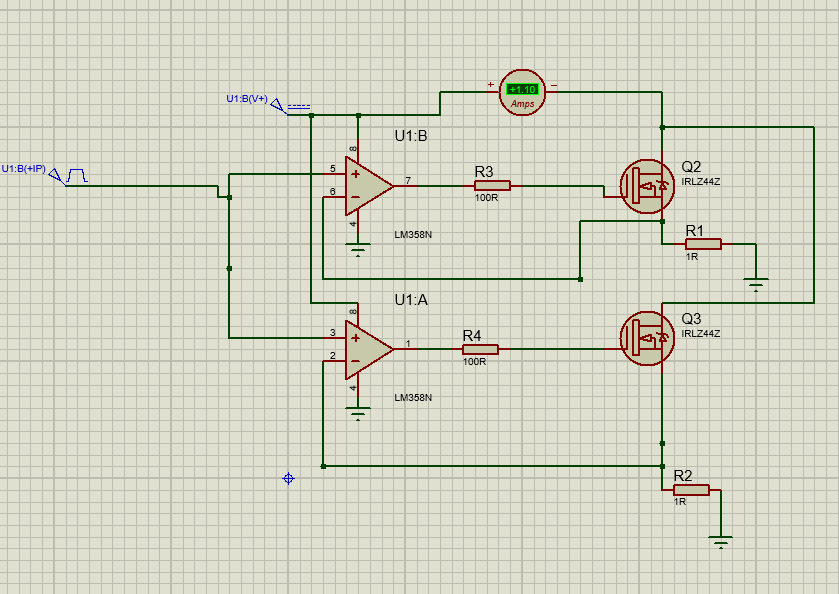
* **Descripción:** Circuito sumidero analógico de corriente regulada en lazo cerrado compuesto por el amplificador operacional LM358N en configuración de retroalimentación negativa, dos transistores MOSFET de nivel lógico IRLZ44N en paralelo (uno por rama de shunt), resistencias de sensado de corriente (R(shunt) = 0.50 Ω cerámicas de 10W) y red de filtrado RC de compuerta.
* **Principio de Operación:** La tensión de consigna del DAC MCP4725 (0 a 3.53 V) se aplica a la entrada no inversora del op-amp. El lazo de retroalimentación negativa fuerza al MOSFET a conducir la corriente exacta que genera una caída en el shunt igual a la consigna, alcanzando una transconductancia total de Gₘ = 2.00 S (rango: 0.00 a 7.06 A teóricos, limitado por firmware a 3.50 A).

#### Diagrama de Interconexión Eléctrica Global ([`sistema.png`](imagenes/sistema.png))
* **`sistema.png`:** Diagrama de interconexión eléctrica global: aislamiento galvánico óptico (PC817, 4N35, MOC3021), topología de buses I2C y SPI, y enlaces UART entre microcontroladores.

---

### 9.7 Instalador Automatizado y Gestor de Librerías de Arduino IDE

Para compilar los firmwares de bajo nivel se requiere contar con las librerías oficiales de comunicación y sensado:

#### Método A: Script Automatizado de 1 Clic (Recomendado)
El proyecto incluye un script de instalación desatendida:
* **Ruta:** [`documentos/instaladores/instalar_librerias_arduino.bat`](instaladores/instalar_librerias_arduino.bat)
* **Operación:**
  1. Detecta automáticamente la ruta local de librerías del usuario en `%USERPROFILE%\Documents\Arduino\libraries`.
  2. Si `arduino-cli` está presente en el sistema, ejecuta `arduino-cli lib install` para cada dependencia.
  3. Si no existe el CLI, ejecuta un script PowerShell con seguridad TLS 1.2 que descarga directamente desde GitHub los paquetes oficiales `.zip` de Adafruit y Maxim, extrayéndolos en la carpeta de librerías sin requerir intervención del usuario.

#### Método B: Gestor Oficial de Librerías de Arduino IDE (GUI)
1. Abrir **Arduino IDE 2.x**.
2. Abrir el *Library Manager* presionando `Ctrl + Shift + I` (o el icono de libros en la barra lateral izquierda).
3. Buscar e instalar:
   * `Adafruit ADS1X15`
   * `Adafruit MCP4725`
   * `MAX6675 library` (Adafruit)
   * `Adafruit AHTX0`
   * `Adafruit BMP280 Library`
4. Al solicitar confirmación de dependencias (*Install library and all its dependencies?*), seleccionar **"Install All"** (instalará automáticamente `Adafruit BusIO` y `Adafruit Unified Sensor`).

> [!NOTE]
> **Gestor de Placas (Boards Manager):**  
> En *Preferences*, añadir la URL de Espressif:  
> `https://raw.githubusercontent.com/espressif/arduino-esp32/gh-pages/package_esp32_index.json`  
> Luego en *Boards Manager* (`Ctrl + Shift + B`), instalar el paquete **`esp32`** de *Espressif Systems*. Para el Arduino Nano, asegurar la instalación del paquete estándar **`Arduino AVR Boards`**.

---

### 9.8 Librerías de C++ del Firmware y Cómo Profundizar

Si tienes conocimientos de software embebido o control en tiempo real, puedes auditar directamente las siguientes librerías de código abierto en `firmware/esp32/RTOS2.0/`:

* **`Adafruit ADS1X15` (I2C `0x48`):** Muestreo analógico de alta resolución (16 bits) para la sonda de pH en Canal A1 dedicado y los shunts cerámicos del sumidero VCSS (A2/A3). *Profundiza en:* `Modulo_PH.cpp` para ver la dedicación a 860 SPS y `Modulo_Fuentes.cpp` para la configuración de la PGA (± 4.096 V).
* **`Adafruit MCP4725` (I2C `0x60`):** Conversor DAC de 12 bits para la consigna analógica de compuerta (V_{gs}) en los MOSFETs IRLZ44N. *Profundiza en:* la escritura en modo rápido (400 kHz) para actualizar la corriente en < 0.8 ms.
* **`Adafruit MAX6675` (SPI Compartido):** Digitalización de 4 termocuplas tipo K con compensación interna de unión fría. *Profundiza en:* `Modulo_Termico.cpp` para ver cómo se conmutan los 4 Chip Selects independientes (GPIO 5, 4, 13, 14) y la detección del bit D₂ (alerta de termopar roto).
* **`Adafruit AHTX0` & `Adafruit BMP280`:** Lectura meteorológica I2C (humedad relativa, temperatura de cabina y presión barométrica). *Profundiza en:* `Task_Web.cpp` para ver cómo se despacha en el payload JSON hacia el SCADA.
* **`LittleFS` & `WebServer` (ESP32):** Servidor HTTP no bloqueante embebido en Core 0 para la interfaz web móvil y endpoints REST API.
* **`FreeRTOS SMP Kernel`:** Sistema operativo multitarea en tiempo real con asignación simétrica a dos núcleos. *Profundiza en:* `visualizacion/diagramas/rtos/fuentes/03_concurrencia_free_rtos.mmd` para auditar el uso de semáforos mutex (`xSemaphoreCreateMutex`), colas (`QueueHandle_t`) y la asignación determinista del lazo VCSS a Core 1 con prioridad 4.

---

### 9.9 Entornos de Desarrollo Utilizados y Recomendación de Antigravity IDE

Para compilar, ejecutar o auditar las distintas capas del sistema, se emplean los siguientes entornos:

1. **Arduino IDE 2.x:** Compilación y carga del firmware en ESP32-S3 (Espressif Board Package v2.0+) y Arduino Nano (ATmega328P).
2. **Python 3.9–3.12:** Ejecución del SCADA de escritorio (`software/telemetria2.0/`) y librerías científicas (`requests`, `pandas`, `matplotlib`, `numpy`, `openpyxl`).
3. **Antigravity IDE (Entorno Recomendado para Visualización Global):**  
   Para la inspección técnica, auditoría y comprensión global de la arquitectura, se recomienda utilizar **Antigravity IDE**:
   * **Visualización Unificada Multi-Lenguaje:** Permite explorar en una sola ventana el firmware C++ de los microcontroladores, los módulos Python del SCADA, los templates web HTML/CSS/JS y los diagramas Mermaid sin necesidad de alternar entre múltiples aplicaciones.
   * **Navegación Semántica y Comprensión Contextual:** Cuenta con asistencia de arquitectura que comprende la relación entre los structs de estado de bajo nivel (`SaludCelda_t`), los lazos de control PI, las interrupciones ZCS y las fases electroquímicas ISA-88.
   * **Previsualización en Vivo:** Permite visualizar directamente la documentación técnica en Markdown, manuales en HTML interactivo y diagramas `.mmd` con su visor integrado.
   * **Exploración Rápida:** Basta con abrir la carpeta raíz del proyecto descomprimido dentro de **Antigravity IDE** para tener acceso inmediato a todo el sistema del proyecto.

---

### 9.10 Comparativa de Métodos de Control: ¿Por qué existen 2 Alternativas?

El proyecto implementa una dualidad fundamentada de métodos tanto en el control físico de potencia como en la supervisión operativa:

#### A. Control de Potencia Térmica AC (Calefacción de Tinas)
* **Método 1: Recorte de Ángulo de Fase (&alpha;-Firing a 120 Hz) con Co-procesador Arduino Nano (`nano.ino`):**
  * *Ventajas:* Regulación analógica ultra-fina y continua en cada semiciclo de 8.33 ms. Garantiza una estabilidad de ± 0.2 °C sin oscilaciones en reactores pequeños como la Celda Hull (267 mL).
  * *Desventajas:* Requiere un microcontrolador esclavo dedicado (Arduino Nano) con interrupción crítica `INT1` para no verse afectado por el jitter de red del ESP32; no puede actualizarse por la interfaz web OTA (exige cable USB físico); genera armónicos de conmutación (ruido EMI/dv/dt) que demandan filtrado RC snubber y optoacoplamiento estricto.
* **Método 2: Paquetes de Ciclos / Ventana Proporcional de Tiempo (`nano2/` con JELDimmer2 o directo en ESP32):**
  * *Ventajas:* Conmuta exclusivamente en el cruce por cero de la senoidal (cero ruido electromagnético de alta frecuencia); algoritmo simplificado que podría ejecutarse directamente en el ESP32 sin microcontrolador esclavo, lo que permitiría actualización 100% inalámbrica por OTA.
  * *Desventajas:* En ventanas de 3 segundos produce variaciones cíclicas de temperatura (oleadas térmicas de ± 1.5 °C) inadmisibles en la Celda Hull de 267 mL (aunque es viable para tinas industriales de 20 a 100 litros con alta inercia térmica).

#### B. Métodos de Supervisión y Operación (Web Móvil vs SCADA de Escritorio)
* **Vía Web Móvil (`http://192.168.4.1`):** Cero instalación de software, accesible desde cualquier celular o tablet a pie de reactor, actualización remota del ESP32 por OTA, calibración asistida de pH. Limitada a un buffer circular en memoria RAM y control puntual.
* **Vía Monitor SCADA de Escritorio (`software/telemetria2.0/`):** Registro continuo a disco en CSV sin límite de tiempo, ejecución automatizada de recetas multietapa ISA-88 con temporizadores programados, balanza virtual de Faraday (Q=∫ I dt), osciloscopio virtual y suite de generación de figuras científicas a 300 DPI.

---

### 9.11 Mapa de Pines (Pinout) del Hardware

A continuación se detalla la asignación completa de pines GPIO del nodo maestro ESP32-S3 y del nodo esclavo Arduino Nano, extraída directamente de [`config.h`](../../firmware/esp32/RTOS2.0/config.h) y [`nano.ino`](../../firmware/firmware/arduino_nano/nano/nano.ino):

#### ESP32-S3 N16R8 (Nodo Maestro — Control y Comunicaciones)

| GPIO | Función | Bus / Protocolo | Dispositivo Conectado | Notas |
|:---:|:---|:---:|:---|:---|
| **8** | I2C SDA | I2C @ 400 kHz | ADS1115, MCP4725, AHT20, BMP280 | Bus compartido con mutex FreeRTOS |
| **9** | I2C SCL | I2C @ 400 kHz | (Reloj del bus I2C) | — |
| **18** | SPI SCK | SPI @ 4 MHz | 4× MAX6675 (reloj compartido) | Modo SPI_MODE0, solo lectura |
| **19** | SPI MISO (SO) | SPI @ 4 MHz | 4× MAX6675 (datos compartidos) | No se usa línea MOSI |
| **5** | SPI CS0 | SPI (Chip Select) | MAX6675 Tina 0 — Desengrase (450W) | Activo en nivel BAJO |
| **4** | SPI CS1 | SPI (Chip Select) | MAX6675 Tina 1 — Decapado (450W) | Activo en nivel BAJO |
| **13** | SPI CS2 | SPI (Chip Select) | MAX6675 Tina 2 — Celda Hull (18W) | Activo en nivel BAJO |
| **14** | SPI CS3 | SPI (Chip Select) | MAX6675 Tina 3 — Niquelado (450W) | Activo en nivel BAJO |
| **17** | UART2 TX | UART @ 9600 bps | Arduino Nano (Pin D0 RX) | Tramas de potencia 8N1 |
| **20** | Relé VCSS | Digital (Active-LOW) | Relé de aislamiento +12V celda | ZCS: corte sin arco voltaico |
| **48** | NeoPixel Data | WS2812 (1-Wire) | LED RGB integrado en DevKit | Baliza de estado del Supervisor |

**Dispositivos I2C y sus Direcciones:**

| Dirección | Dispositivo | Función | Resolución |
|:---:|:---|:---|:---:|
| `0x48` | ADS1115 | ADC 16-bit: pH Canal A1 dedicado (Po) y shunts VCSS (A2/A3) | 16 bits, PGA ±4.096V |
| `0x60` | MCP4725 | DAC 12-bit: consigna V_{gs} del MOSFET VCSS | 12 bits, Fast Mode |
| `0x38` | AHT20 | Humedad relativa y temperatura de cabina | ±2% HR, ±0.3°C |
| `0x76`/`0x77` | BMP280 | Presión barométrica | ±1 hPa |

#### Arduino Nano ATmega328P (Nodo Esclavo — Potencia AC 60 Hz)

| Pin | Función | Señal | Dispositivo Conectado | Notas |
|:---:|:---|:---:|:---|:---|
| **D0 (RX)** | UART RX | UART @ 9600 bps | ESP32-S3 (GPIO 17 TX) | Recepción de tramas de potencia |
| **D3 (INT1)** | Cruce por Cero | Interrupción externa | Optoacoplador 4N35 | Disparo a 120 Hz (flancos de subida) |
| **D7** | Gate TRIAC T0 | Digital (pulso 80 µs) | MOC3021 → BTA24 Tina 0 | PORTD bit 7 |
| **D8** | Gate TRIAC T1 | Digital (pulso 80 µs) | MOC3021 → BTA24 Tina 1 | PORTB bit 0 |
| **D9** | Gate TRIAC T2 | Digital (pulso 80 µs) | MOC3021 → BTA24 Tina 2 | PORTB bit 1 |
| **D10** | Gate TRIAC T3 | Digital (pulso 80 µs) | MOC3021 → BTA24 Tina 3 | PORTB bit 2 |

> [!IMPORTANT]
> **Manipulación Directa de Registros PORT:**  
> El firmware del Nano utiliza operaciones atómicas de bits sobre los registros PORTD y PORTB (`PORTD &= ~0b10000000; PORTB &= ~0b00000111;`) para apagar los 4 TRIACs en exactamente 2 ciclos de CPU (125 ns a 16 MHz), en lugar de 4 llamadas secuenciales a `digitalWrite()` que introducirían \sim 20 μs de jitter acumulado.

---

## 10. Planta Física, Ficha Técnica y Modularidad de Hardware

### 10.1 Ficha Técnica Consolidada de la Plataforma

A continuación se resumen las especificaciones y límites operacionales nominales del prototipo:

| Parámetro / Subsistema | Especificación Técnica Nominal | Observaciones de Ingeniería |
| :--- | :--- | :--- |
| **Alimentación Primaria** | 120 VAC / 60 Hz, entrada directa en 1 paso | Fuente industrial conmutada 12V / 10A DC con fusible interno de protección. |
| **Calefacción AC (Tinas 1, 2 y 4)** | 3× Resistencias de inmersión de 450 W blindadas en acero inoxidable | Conmutación por ángulo de fase α (TRIACs BTA24-600B + optos MOC3021). |
| **Calefacción AC (Tina 3 - Celda Hull)** | 1× Calentador de cartucho de precisión de 18 W (267 mL) | Sintonizado analíticamente sin sobretiro (Kₚ = 16.71, Kᵢ = 0.0239). |
| **Demanda Eléctrica Máxima Total** | ≈ 1368 W pico (≈ 11.4 A a 120 VAC) | Perfectamente compatible con tomacorrientes estándar de laboratorio (15A). |
| **Sumidero de Corriente VCSS** | Rango: 0.00 a 3.50 A DC continuo / pulsado a 10 Hz | 2× MOSFETs IRLZ44N en paralelo sobre disipador con ventilador de 12V. |
| **Resolución del Sumidero VCSS** | Consigna: 12 bits (MCP4725) \| Sensado: 16 bits (ADS1115) | Shunts cerámicos de 1.0 Ω / 10W por rama (caída 1.0 V/A). |
| **Canales de Temperatura** | 4× Termopares Tipo K multiplexados por SPI (MAX6675) | Resolución de 0.25°C, compensación de unión fría integrada. |
| **Canales Electroquímicos** | 1× Sonda analógica de pH (PH-4502C + ADS1115 Canal A1 dedicado) | Rango 0 a 14 pH | Exactitud ±0.05 pH (Calibración NVS Tri-Modo) |
| **Sensado Meteorológico** | Sensor dual I2C AHT20 (Humedad ± 2%) + BMP280 (Presión ± 1 hPa) | Monitoreo ambiental de cabina de control. |
| **Interfaz de Red y Telemetría** | Wi-Fi 802.11 b/g/n (SoftAP `Uli` + Station) + USB Serial 115200 bps | Servidor web asíncrono en Core 0, SCADA en Python a 10 Hz. |

---

### 10.2 Distribución de Pines y Conexión en Zócalos Hembra

Para maximizar la robustez y facilitar el mantenimiento, la arquitectura física del prototipo implementa una estrategia de **montaje sobre zócalos hembra** para todos los microcontroladores y circuitos integrados sensores, combinada con **clemas de tornillo** para líneas de potencia y **cables Dupont reforzados** para buses de señal:

#### 1. Módulos Montados en Zócalos Hembra (Extracción Rápida sin Soldador):
* **Microcontrolador Maestro ESP32-S3 DevKit:** Montado sobre dos tiras de zócalos hembra de 22 pines. Concentra el bus I2C (GPIO 8 SDA, GPIO 9 SCL), el bus SPI (GPIO 18 SCK, GPIO 19 MISO, CS 5, 4, 13, 14), UART2 (GPIO 17 TX) y la baliza Neopixel integrada (GPIO 48).
* **Microcontrolador Esclavo Arduino Nano (ATmega328P):** Montado sobre zócalos hembra de 15 pines. Recibe interrupción de cruce por cero en Pin D3 (INT1), dispara compuertas TRIAC por Pines D7–D10 y recibe consignas por Pin D0 (RX).
* **Conversor ADC ADS1115 (16 bits):** Zócalo hembra de 10 pines. Conecta al bus I2C (`0x48`) con Canal A1 dedicado a la sonda de pH (señal Po), Canal A0 para referencia de masa limpia GND2 y canales A2/A3 para shunts de corriente SH1 y SH2.
* **Conversor DAC MCP4725 (12 bits):** Zócalo hembra de 6 pines en bus I2C (`0x60`). Su salida analógica `VOUT` entrega la consigna V(ref) al sumidero VCSS.
* **Sensor Ambiental AHT20 + BMP280:** Zócalo hembra de 4 pines conectado al riel de 3.3V, GND, SDA y SCL.
* **4× Módulos MAX6675 (Termopares):** Montados sobre zócalos hembra independientes. Comparten las líneas SCK (GPIO 18), SO (GPIO 19), 3.3V y GND; cada módulo dispone de su línea `CS` dedicada y bornera de tornillo para el termopar Tipo K.

#### 2. Placa Casera del Sumidero VCSS ([`VCSS.png`](imagenes/VCSS.png)):
Construida en placa de circuito según el diagrama de ingeniería analógica con las siguientes interfaces mecánicas:
* **Clema 1 (Referencias):** Bornes para `GND` de potencia y `RefGND` del MCP4725 (eliminación de lazos de masa).
* **Clema 2 (Alimentación y Consigna):** Borne `VDD` (+12V de la fuente SMPS) y borne `VREF` (consigna analógica del DAC).
* **Clema 3 (Potencia de Celda):** Borne `OUT+` (+12V hacia relé de celda COM 1) y borne `OUT-` (retorno catódico hacia Drains de MOSFETs).
* **Headers Macho de Sensado SH1 y SH2:** Pines de conexión directa hacia los canales A2 y A3 del ADS1115.
* **Disipador Térmico con Ventilación Forzada:** Los transistores MOSFET IRLZ44N van fijados con pasta térmica y aislante de mica al disipador de aluminio.

---

### 10.3 Guía de Remplazabilidad y Mantenimiento en Campo

Gracias al diseño modular en zócalos hembra y clemas, cualquier intervención de servicio se realiza en minutos sin herramientas de soldadura:

1. **Sustitución de un Módulo Sensor (MAX6675, ADS1115, MCP4725 o Ambiental):**
   * Desconectar la alimentación general de 120V de la planta.
   * Sujetar el módulo defectuoso por los bordes laterales y extraerlo verticalmente hacia arriba del zócalo hembra.
   * Insertar el módulo nuevo asegurando la orientación correcta de los pines (referenciarse por la serigrafía de VCC y GND).
   * En el caso del MAX6675, transferir los cables de la sonda de termopar respetando la polaridad (cable rojo al terminal negativo -, cable amarillo al positivo +).
2. **Sustitución o Servicio de la Etapa VCSS:**
   * La etapa de corriente está desacoplada mediante clemas de tornillo. Para sustituirla o repararla, basta con aflojar los tornillos de las clemas 1, 2 y 3 y desconectar los cables Dupont de los headers SH1/SH2.
   * Al estar documentada con su esquemático completo ([`VCSS.png`](imagenes/VCSS.png)), cualquier técnico o ingeniero puede verificar el operacional LM358N, comprobar las resistencias de compuerta de 100 Ω o sustituir los transistores MOSFET IRLZ44N.
3. **Sustitución de Microcontroladores (ESP32-S3 o Arduino Nano):**
   * Retirar el microcontrolador del zócalo hembra.
   * Programar la placa de repuesto conectándola por USB a la PC de laboratorio:
     * Para ESP32-S3: Abrir `firmware/esp32/RTOS2.0/RTOS2.0.ino` en Arduino IDE y cargar el firmware.
     * Para Arduino Nano: Abrir `firmware/arduino_nano/nano/nano.ino` y cargar con procesador `ATmega328P (Old Bootloader)`.
   * Insertar la nueva placa en los zócalos y reanudar la operación.

---

### 10.4 Galería Fotográfica de la Planta en Operación

> [!NOTE]
> **Material Fotográfico de Laboratorio (Espacios Reservados):**  
> En estos apartados se incorporarán las fotografías de la planta física e instrumentación una vez concluido el levantamiento fotográfico del laboratorio.

#### 10.4.1 Vista Panorámica de la Planta Piloto
*📷 Espacio reservado para fotografía panorámica de la estación de trabajo (tren de 4 tinas, computadora SCADA y panel de control).*

#### 10.4.2 Gabinete de Instrumentación y Control
*📷 Espacio reservado para fotografía en detalle del gabinete mostrando la placa ESP32-S3, Arduino Nano, regulador LM2596 indicando 6.80V, módulo de relés y etapa VCSS con shunts cerámicos.*

#### 10.4.3 Tinas de Proceso y Celda Hull
*📷 Espacio reservado para fotografías de las tinas químicas de 450W y la celda Hull normalizada de 267 mL con electrodos instalados.*

#### 10.4.4 Sondas y Sensores
*📷 Espacio reservado para fotografías en detalle de los termopares Tipo K y las sondas de pH.*

---

## 11. Preguntas Frecuentes (FAQ)

1. **¿Por qué el Arduino Nano no se actualiza por la interfaz web OTA (`/update`)?**  
   Porque el servidor web y el gestor OTA residen físicamente en la memoria Flash del ESP32-S3. El Arduino Nano (ATmega328P) es un microcontrolador esclavo independiente aislado galvánicamente que solo se comunica por UART2 y no cuenta con líneas de reset (DTR) conectadas al ESP32 para activar el bootloader remoto. Debe actualizarse mediante cable USB directo desde Arduino IDE.
2. **¿Por qué se utilizó un Arduino Nano y no se ejecutó el control de TRIACs en el ESP32?**  
   Por determinismo temporal estricto en microsegundos y aislamiento eléctrico. Las tareas de red Wi-Fi y FreeRTOS en el ESP32 introducen jitter que desestabilizaría el disparo de fase a 60 Hz. El ATmega328P atiende la interrupción externa INT1 en 8 &mu;s sin perturbaciones de red.
3. **¿Qué sucede si el ESP32 se congela o se pierde la comunicación serie con el Arduino Nano?**  
   El Arduino Nano cuenta con un Perro Guardián UART de 3000 ms. Si no recibe tramas válidas del ESP32 durante 3 segundos, fuerza de inmediato el apagado total de los 4 TRIACs (corte Fail-Safe) para evitar sobrecalentamiento.
4. **Al subir el código al Nano aparece `avrdude: stk500_recv(): programmer is not responding`. ¿Qué hacer?**  
   En Arduino IDE, vaya a `Herramientas -> Procesador` y cambie a **`ATmega328P (Old Bootloader)`** (57600 baudios). Asegúrese de desconectar los 110V/220V AC antes de conectar el cable USB.
5. **¿Por qué NO se puede medir pH al mismo tiempo que la corriente de electrodeposición o la calefacción? ¿Por qué se falsean las lecturas y se dañan los electrodos?**  
   Por tres razones físicas, químicas y electrónicas fundamentales:
   * **Extrema delicadeza del electrodo de vidrio combinado:** El bulbo sensor es una membrana de vidrio de intercambio iónico ultradelgada (~0.1 mm de espesor) con una impedancia interna gigantesca (50 a 100 M&Omega;). Su referencia interna se comunica con el líquido exterior mediante un diafragma o fritada cerámica porosa sumergida en electrolito de KCl saturado (o 3M) con alambre de plata/cloruro de plata (Ag/AgCl). Es el sensor más frágil de toda la planta piloto.
   * **Falseamiento y daño por corriente en el baño:** Al aplicar corriente entre el ánodo (+12V) y el cátodo, se establece un fuerte gradiente de potencial óhmico (iR) a través del líquido conductor. Si el electrodo de pH está sumergido durante la electrólisis, este potencial se superpone a la diminuta señal electroquímica del bulbo (~59.16 mV/pH), produciendo lecturas completamente falsas y caóticas. Peor aún: **la corriente eléctrica fuerza el paso de electrones a través del diafragma cerámico poroso**, electrolizando el KCl interno, precipitando sales insolubles y polarizando permanentemente el semielemento de Ag/AgCl, lo que **destruye el electrodo de forma irreversible**.
   * **Destrucción térmica por alta temperatura (> 50–60 °C):** Los electrodos estándar de laboratorio están calibrados para operar entre 0 y 50 °C (máximo 60 °C). En las tinas de desengrase y decapado (85 a 90°C), el choque térmico dilata y agrieta el bulbo de vidrio, disuelve aceleradamente la membrana de silicato en pH alcalino fuerte y hierve el electrolito interno de KCl expulsándolo hacia el exterior. Por norma química, **el pH de baños calientes nunca se mide in situ a 90 °C**: se toma una pequeña alícuota con pipeta, se enfría en vaso de precipitados a 25 °C y se mide en reposo.
   * **Interferencia en el convertidor ADS1115 (Inyección de carga):** El chip ADS1115 conmuta un condensador interno de muestreo (*switched-capacitor*) entre la entrada de pH (Canal A1 a ~1.765 V) y los shunts de la fuente (canales A2/A3 a ~0.75 V). Al alternar lecturas entre canales con voltajes e impedancias tan dispares, el condensador vuelca carga residual sobre las entradas adyacentes (*charge injection*). Esto hace que el chip "monte voltaje" artificial sobre los shunts y viceversa: **leer el pH altera la medición de corriente de la fuente, y leer la fuente altera la lectura del pH**.
   * **Protocolo Operativo Obligatorio:** El pH se mide y ajusta **exclusivamente al inicio del ensayo**, a temperatura ambiente y con la celda apagada. Concluida la medición, la sonda se enjuaga con agua destilada y **se guarda de inmediato en su vaina protectora con solución de KCl 3M**. En el software, el módulo de pH se desactiva (`phModuloActivo = false`) para que el ADS1115 quede dedicado al 100% a la fuente VCSS sin interferencias.
6. **¿Cuándo usar la interfaz web móvil y cuándo el SCADA de escritorio?**  
   Use la web móvil para inspección rápida a pie de tina, calibración de electrodos de pH y actualización OTA. Use el SCADA para ensayos formales de investigación, recetas automatizadas ISA-88, balance de carga eléctrica y gráficas a 300 DPI.
7. **¿Por qué las gráficas en vivo del SCADA muestran 60 segundos mientras que la Suite Científica procesa todo el ensayo?**  
   Para evitar sobrecarga de CPU y congelamiento de la GUI en tiempo real a 10 Hz. La Suite Científica lee el archivo CSV continuo guardado en disco al finalizar el ensayo y procesa la totalidad del experimento en alta resolución.
8. **¿Dónde se guardan los datos experimentales?**  
    En `telemetria/experimentos/ensayo_AAAAMMDD_HHMMSS.csv`, compatibles directamente con Excel, OriginLab y MATLAB.
9. **`app.py` no conecta con el ESP32 (`ConnectionError` o `Timeout`). ¿Qué verificar?**  
    (a) Confirmar que la computadora está conectada a la red Wi-Fi `Uli` emitida por el ESP32. (b) Verificar que la IP `192.168.4.1` responde a `ping`. (c) Desactivar temporalmente el firewall de Windows o agregar una excepción para Python. (d) Si aparece `OSError: [Errno 113] No route to host`, el ESP32 puede estar en reinicio — esperar 5 segundos y reintentar.
10. **El archivo CSV aparece truncado o corrupto. ¿Cómo recuperar los datos?**  
    Si el SCADA fue cerrado abruptamente (corte de energía, crash), la última línea del CSV puede estar incompleta. Abrir el archivo en un editor de texto, eliminar la última línea truncada y guardar. Los datos anteriores son íntegros. Para prevenir esto, el logger escribe con `flush()` cada 10 segundos.
11. **¿Cómo verificar que el enlace UART entre el ESP32 y el Nano está activo?**  
    En la pantalla de Diagnóstico del SCADA (Sección 4.1, Pantalla 6), verificar que no aparezca el error `ERR_UART_NANO_TIMEOUT` (código 50). Alternativamente, en la vista web `consola.html`, buscar los mensajes de tipo `[UART]` que confirman la transmisión de tramas de potencia cada segundo.

---

## 12. Glosario de Términos Técnicos

Esta sección explica de forma clara y directa los términos técnicos utilizados a lo largo de este manual, organizados por área temática.

### 12.1 Electrónica y Hardware

* **ADC (Convertidor Analógico a Digital):** Chip que traduce un voltaje continuo del mundo real (como el de un sensor de pH o un shunt) a números enteros comprensibles por un microcontrolador. En este equipo se usa el ADS1115 de 16 bits.
* **Celda Hull:** Tina de laboratorio de 267 mL con geometría trapezoidal normalizada. Al colocar el ánodo y el cátodo en ángulo inclinado, genera un gradiente continuo de corriente a lo largo de la probeta, permitiendo evaluar en una sola prueba cómo responde el baño químico a diferentes densidades de corriente.
* **Convertidor Buck:** Fuente reductora conmutada de alta eficiencia que baja un voltaje DC alto a uno menor casi sin generar calor. En la plataforma baja los 24V de la fuente principal a 5V para alimentar la electrónica.
* **DAC (Convertidor Digital a Analógico):** Chip que realiza la función inversa al ADC: recibe un número digital del microcontrolador y entrega un voltaje equivalente. En el proyecto se usa el MCP4725 para fijar la consigna analógica de corriente.
* **Diodo Flyback:** Diodo conectado en paralelo a una bobina (como la de un relé) para drenar el pico de alto voltaje inducido al desenergizarla repentinamente, evitando dañar los transistores que la conmutan.
* **Disipador Térmico:** Bloque metálico (generalmente de aluminio con aletas) fijado a componentes de potencia para disipar el calor que generan hacia el ambiente y evitar que se dañen por sobrecalentamiento.
* **Filtro Snubber (RC):** Circuito simple formado por una resistencia y un condensador en serie, conectado en paralelo con un TRIAC para amortiguar picos rápidos de voltaje (dv/dt) producidos al conmutar cargas en corriente alterna.
* **LDO (Low-Dropout Regulator):** Regulador de voltaje lineal que entrega una tensión muy limpia y libre de ruido con poca diferencia de potencial entre la entrada y la salida. Se usa el AMS1117 para suministrar 3.3V estables a los sensores.
* **MOSFET:** Transistor semiconductor gobernado por voltaje en su compuerta (Gate). En la fuente VCSS se emplean transistores IRLZ44N para regular con exactitud la corriente que fluye a través de la celda.
* **Neopixel (WS2812):** LED RGB inteligente que integra su propio circuito de control digital, lo que permite generar cualquier color o patrón luminoso utilizando un único cable de datos. En el equipo funciona como baliza visual de estado.
* **Optoacoplador:** Componente que transmite señales mediante un haz interno de luz infrarroja hacia un fototransistor o fototriac. Aísla eléctricamente el microcontrolador del circuito de potencia para que cualquier falla en la red de 120 VAC no dañe los componentes lógicos.
* **Relé:** Interruptor electromecánico que permite abrir o cerrar un circuito de potencia mediante una pequeña señal de control. Se utiliza para cortar físicamente la alimentación a la celda en caso de emergencia.
* **Resistencia Shunt:** Resistencia de precisión con un valor óhmico muy bajo y conocido. Al circular corriente a través de ella, se mide la pequeña caída de voltaje resultante para calcular la corriente exacta mediante la Ley de Ohm (I = V / R).
* **Termopar Tipo K:** Sensor compuesto por dos alambres metálicos de distinta aleación (cromel y alumel) soldados en su extremo. Al calentarse generan una fuerza electromotriz en milivoltios proporcional a la temperatura, permitiendo medir desde bajo cero hasta más de 1000 °C.
* **TRIAC:** Semiconductor de potencia para corriente alterna que funciona como un interruptor electrónico bidireccional. Permite modular la energía que reciben las resistencias calefactoras disparándose en instantes controlados de la onda senoidal.

### 12.2 Firmware e Informática Embebida

* **Buffer Circular FIFO (First-In, First-Out):** Zona de memoria donde los datos más antiguos se sobreescriben automáticamente al ingresar lecturas nuevas. Permite graficar en tiempo real sin acumular millones de registros que agoten la memoria RAM.
* **Deadlock (Interbloqueo):** Condición de bloqueo mutuo en la que dos o más tareas quedan esperando indefinidamente recursos retenidos entre sí, paralizando la ejecución. Se previene implementando tiempos límite de espera (*timeouts*).
* **Firmware:** Programa informático grabado directamente en la memoria Flash no volátil del microcontrolador. Gestiona de manera inmediata el hardware, los sensores y las comunicaciones de bajo nivel.
* **FreeRTOS:** Sistema operativo de tiempo real para microcontroladores. Administra múltiples tareas concurrentes asignándoles prioridades y tiempos de procesador para asegurar determinismo temporal.
* **Hard Fault / Kernel Panic:** Estado de error crítico en el procesador originado cuando el programa intenta acceder a direcciones de memoria inválidas o ejecutar instrucciones no permitidas, forzando un reinicio defensivo del microcontrolador.
* **Heap (Memoria Dinámica):** Región de memoria RAM asignada y liberada dinámicamente en tiempo de ejecución. Si se solicita memoria sin liberarla adecuadamente se produce una fuga de memoria (*memory leak*) que puede desestabilizar el sistema.
* **Jitter:** Variación o dispersión temporal no deseada en la periodicidad de ejecución de un evento recurrente (por ejemplo, fluctuaciones de microsegundos en el disparo de pulsos).
* **LittleFS:** Sistema de archivos ligero optimizado para memorias Flash SPI de microcontroladores. Permite almacenar archivos HTML, imágenes y archivos de configuración dentro del ESP32 como si fuera una unidad de disco interna.
* **Mutex (Exclusión Mutua):** Mecanismo de sincronización de software que funciona como un pase de acceso único: únicamente una tarea a la vez puede adquirirlo para acceder a un periférico compartido (por ejemplo, el bus I2C), evitando colisiones de datos.
* **NVS (Non-Volatile Storage):** Partición de memoria Flash en el ESP32 destinada a preservar configuraciones de calibración (pH, offsets) y parámetros de red incluso al desconectar la energía de la planta.
* **OTA (Over-The-Air):** Protocolo de actualización de firmware por vía inalámbrica Wi-Fi, permitiendo reprogramar el microcontrolador sin requerir conexión física por cable a la computadora.
* **REST API:** Conjunto de reglas y rutas web (como `/api/termico` o `/api/fuente`) que facilitan el intercambio estructurado de parámetros y telemetría en formato JSON entre el microcontrolador y la interfaz de usuario.
* **Semáforo:** Objeto de sincronización en sistemas multitarea utilizado para notificar a una tarea que un recurso está disponible o que un evento ha finalizado para habilitar su ejecución.
* **Server-Sent Events (SSE):** Protocolo de transmisión web unidireccional que permite al ESP32 enviar actualizaciones continuas en vivo hacia el navegador sin requerir peticiones de sondeo repetitivas.
* **Stack (Pila de Ejecución):** Memoria rápida asignada de forma estática a cada tarea de FreeRTOS para guardar variables locales y direcciones de retorno de funciones. Un consumo excesivo puede ocasionar desbordamiento de pila (*stack overflow*).
* **Watchdog (Perro Guardián):** Temporizador de seguridad por hardware que el software debe refrescar periódicamente. Si el firmware se detiene o congela, el temporizador expira y fuerza un reinicio automático para restablecer la operación.

### 12.3 Control e Instrumentación

* **Blanking (Ventana de Gracia):** Lapso temporal durante el cual el sistema suspende de forma transitoria la lectura de un sensor tras la conmutación de una carga eléctrica, evitando lecturas erróneas causadas por transitorios eléctricos.
* **Burst Firing (Paquetes de Ciclos):** Modalidad de control de potencia en corriente alterna que entrega energía conduciendo trenes de ciclos completos conmutados en el cruce por cero, eliminando interferencias de alta frecuencia.
* **Control PI (Proporcional-Integral):** Lazo de control automático que combina una acción proporcional (Kₚ) dependiente de la magnitud del error actual y una acción integral (Kᵢ) que acumula el error pasado para eliminar desviaciones en estado estacionario.
* **Cruce por Cero (ZCS / Zero-Cross):** Punto exacto en el que el voltaje de la señal senoidal alterna cruza la referencia de cero voltios (120 veces por segundo en 60 Hz). Sincronizar las conmutaciones en este punto previene transitorios inductivos y emisión electromagnética.
* **Ecuación de Nernst:** Relación fisicoquímica que determina el potencial eléctrico generado por un electrodo sensor en función de la actividad iónica de la solución y la temperatura absoluta.
* **Electrodo de Vidrio Combinado:** Sensor electroquímico de pH compuesto por una membrana de vidrio de intercambio iónico y un semielemento de referencia de plata/cloruro de plata (Ag/AgCl). Genera aproximadamente 59.16 mV por unidad de pH a 25 °C.
* **ETS (Equivalent Time Sampling):** Técnica de muestreo estroboscópico que reconstruye formas de onda repetitivas de alta velocidad tomando muestras espaciadas a lo largo de ciclos sucesivos, logrando alta resolución temporal sin demandar convertidores de costo elevado.
* **Failsafe (Modo Seguro ante Fallas):** Principio de diseño en ingeniería por el cual, ante la pérdida de señales de sensado o comunicación, las salidas de potencia se desconectan de inmediato para colocar la planta en condición de seguridad pasiva.
* **IAE (Integral del Error Absoluto):** Índice de desempeño en teoría de control que cuantifica la integral del valor absoluto del error a lo largo del tiempo. Valores menores certifican mayor rapidez y estabilidad del lazo de regulación.
* **Recorte de Fase (Phase Firing):** Técnica de dimerización en corriente alterna en la que se retarda el disparo del TRIAC un intervalo programado tras cada cruce por cero, regulando de forma continua y suave la potencia entregada a la carga.
* **SCADA (Supervisory Control and Data Acquisition):** Plataforma de software para computadora dedicada a la supervisión gráfica en tiempo real, registro continuo de datos a disco, parametrización de procesos y gestión de alarmas.
* **Setpoint (SP / Consigna):** Valor numérico de referencia deseado por el operador para una variable controlada (por ejemplo, consigna de temperatura de 85.0°C o de corriente de 1.50 A).
* **Soft-Start (Arranque Suave):** Rampa de incremento gradual programada al energizar una salida (500 ms en el sumidero VCSS), suprimiendo sobrecorrientes bruscas que comprometan la fuente o los sustratos químicos.
* **Variable de Proceso (PV):** Magnitud física real medida en la planta en un instante determinado a través de la instrumentación (por ejemplo, temperatura actual leída en el baño químico).
* **VCSS (Voltage-Controlled Current Sink):** Sumidero de corriente regulado por voltaje. Circuito analógico en lazo cerrado que absorbe una corriente precisa y proporcional a una tensión de consigna, independientemente de variaciones en la resistencia de la celda.

### 12.4 Comunicaciones y Protocolos

* **Baudios (Baud Rate):** Unidad que representa la tasa de símbolos o transiciones por segundo en una línea de comunicación serie (por ejemplo, 115200 baudios en el puerto USB o 9600 baudios en el enlace entre microcontroladores).
* **GPIO (General Purpose Input/Output):** Terminales digitales de propósito general de un microcontrolador configurables por programa como entradas de sensado o salidas de control.
* **I2C (Inter-Integrated Circuit):** Bus de comunicación serie síncrono a dos líneas (SDA para datos y SCL para reloj) que conecta múltiples circuitos integrados compartiendo el mismo bus mediante direcciones de 7 bits.
* **SoftAP (Punto de Acceso por Software):** Configuración en la que el microcontrolador genera su propia red inalámbrica Wi-Fi independiente (nombrada `Uli`), posibilitando la conexión directa de equipos cliente sin recurrir a un enrutador comercial.
* **SPI (Serial Peripheral Interface):** Bus de comunicación serie síncrono punto a multipunto con líneas dedicadas de reloj (SCK), datos (MISO) y selección de chip (CS) para cada dispositivo esclavo, operando a altas tasas de transferencia.
* **UART (Universal Asynchronous Receiver-Transmitter):** Protocolo serie asíncrono punto a punto fundamentado en líneas separadas de transmisión (TX) y recepción (RX) con velocidades y formatos de trama preacordados entre ambos nodos.

---

## 13. Reconocimientos a Proyectos Open Source & Términos de Uso Libre

* **Reconocimiento a Librerías y Proyectos de Código Abierto:**
  * **Espressif Systems:** Framework ESP-IDF y Arduino ESP32 Core.
  * **Adafruit Industries:** Controladores de instrumentación (`Adafruit ADS1X15`, `Adafruit MCP4725`, `Adafruit AHTX0`, `Adafruit BMP280`, `MAX6675`).
  * **Python Software Foundation & Matplotlib Team:** Ecosistema científico de análisis de datos.
  * **Mermaid-js & KaTeX:** Motores de renderizado de arquitectura y fórmulas matemáticas.
  * **Antigravity IDE (Google DeepMind):** Entorno unificado de navegación y pair-programming inteligente.
* **Términos de Consulta y Licencia:**
  * **Copyright (c) 2026 Salvador² C Dev Team. Todos los derechos reservados.**
  * Este manual operativo, los diagramas de conexionado, el código fuente y el firmware forman parte de un proyecto de investigación y tesis de licenciatura en curso.
  * Se autoriza la consulta y acceso público exclusivamente con fines de evaluación académica, docencia y revisión técnica.
  * Queda estrictamente prohibida la copia, reproducción, modificación, distribución o explotación comercial total o parcial sin autorización previa, expresa y por escrito de **Salvador² C Dev Team**.
